# This is a OpenLane SoC project Repository.

### Exand to see the process for shared folders in linux and windows

  
<b>Expand / Creating Shared Folder</b>

  ## Setting Up Shared Folder Between Windows and Linux VirtualBox

While working on my RISC-V SoC project in the Linux VirtualBox environment, I needed to share screenshots and files from my Linux VM to my Windows system. Here’s exactly what I did, step by step:

1. __Creating a Shared Folder in Windows__

   
    First, I created a separate folder in my Windows system to keep things organized and avoid mixing with other screenshots.
    I planned to use this folder whenever I wanted to move files between Linux and Windows.

    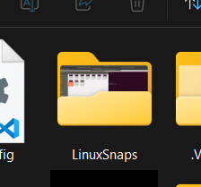

2. __Configuring Shared Folder in VirtualBox Settings__
   

    - Then, I configured this folder as a shared folder in VirtualBox:
    I completely powered off the virtual machine (not saved state).
    Then I opened VirtualBox > Settings > Shared Folders for my VM and added the Folder.

    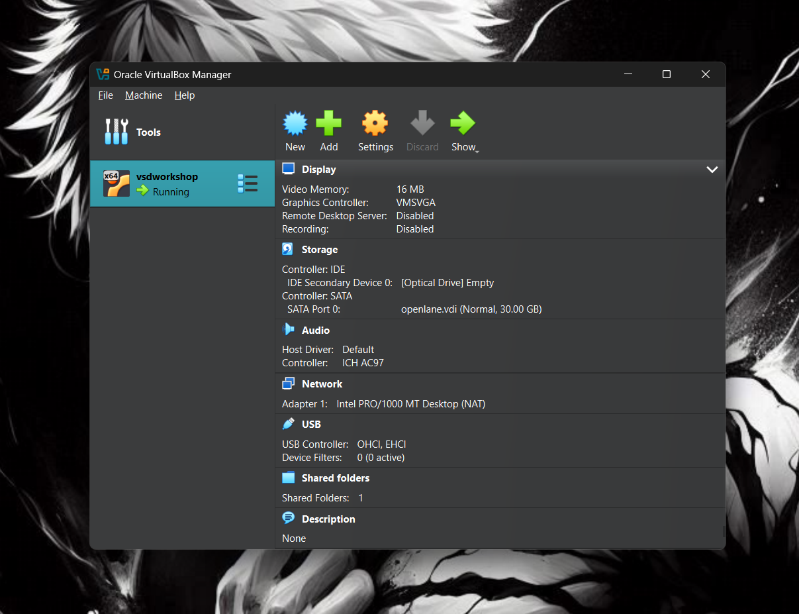
    
    - #### Click on the small "plus file" icon on the right.

    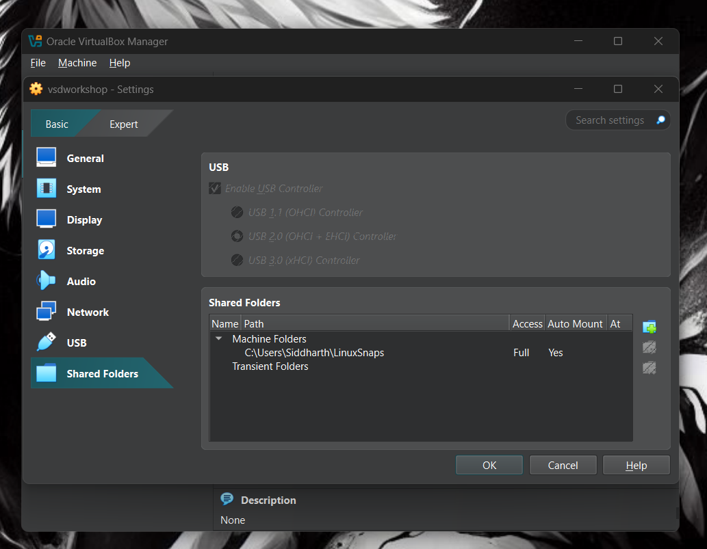
    
    - #### Then do the simple process shown in the image below to create the folder.
    - #### "MAKE SURE YOUR VM IS COMPLETELY SWITCHED OFF AND NOT IN SAVED STATE"

    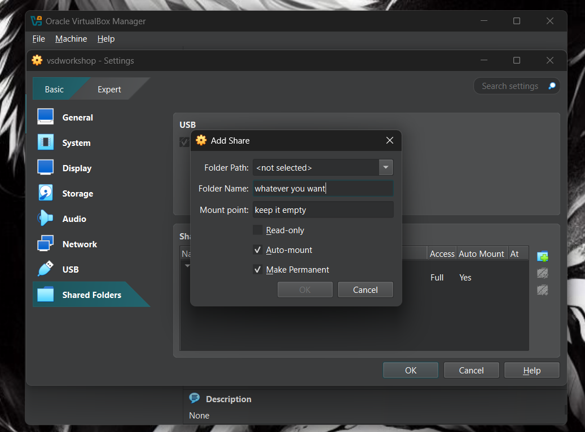

    - #### Just click ok and there you go.

    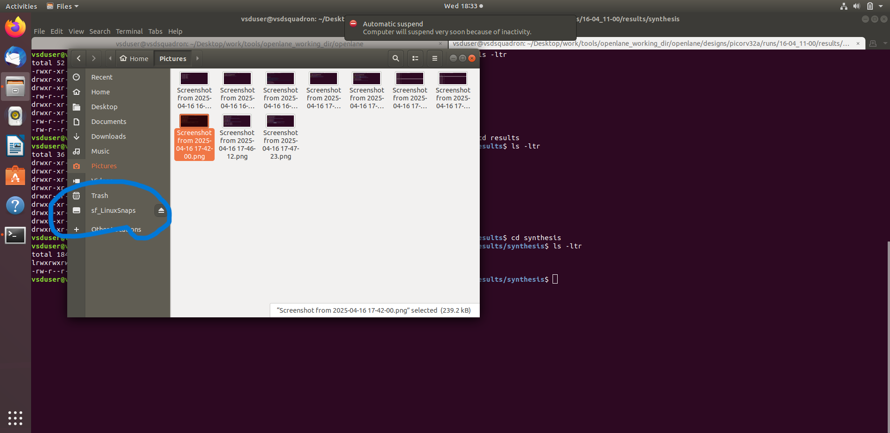

    - #### As you can see there is a folder named LinuxSnaps.

#### Upto this everything should be easy : Next if the problem occurs as it did in mine.

3. __Booting into Linux & Checking the Folder__

    I added the folder but i wasn't been able to see it in my linux windows 
    SO i used this command to create the directory but it failed by saying file already exist.
    To proceed further i needed to make sure that VirtualBox Guest Additions are installed in my Linux VM. This is necessary for shared folders to work.

    Then i used this commands:
    sudo apt update
    sudo apt install virtualbox-guest-utils
    Reboot the Virtual Machine: After installation, reboot your Linux VM by typing:
    sudo reboot
    
    After starting the Linux VM again, I ran:
    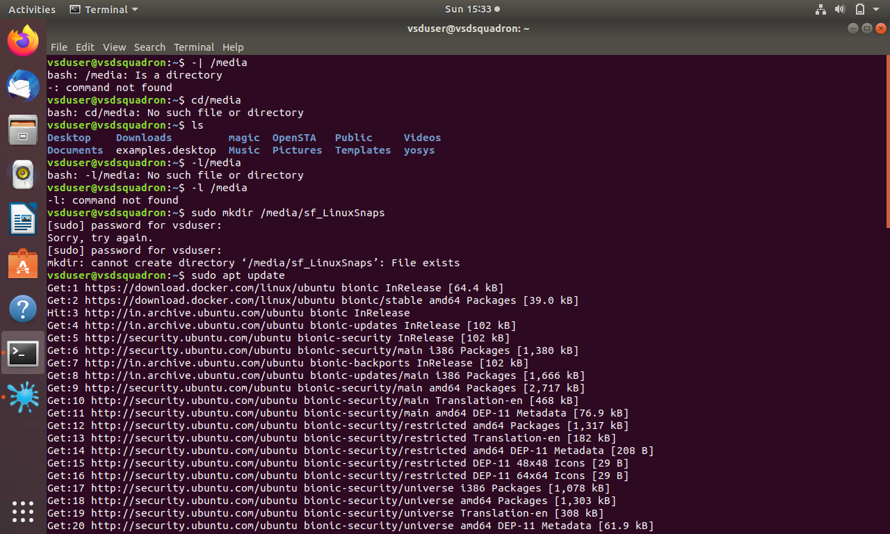
    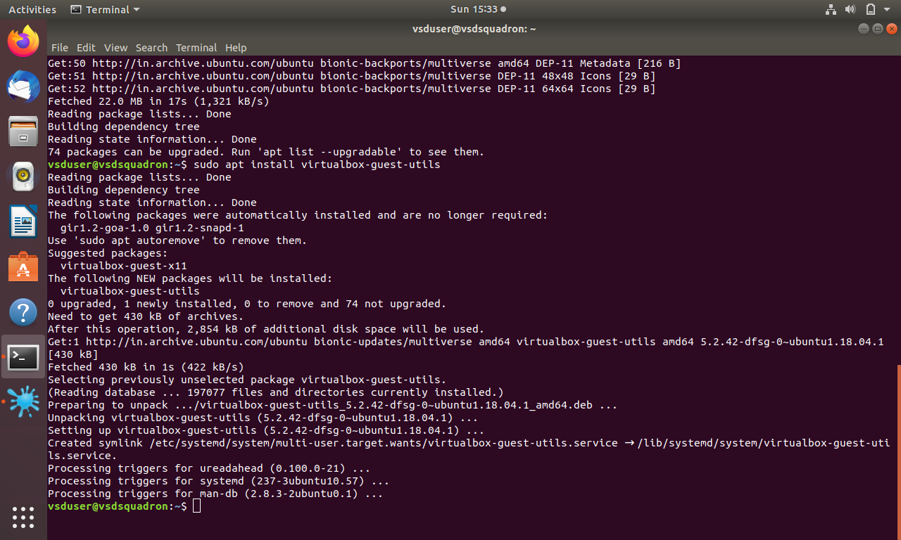

4. __Fixing the Permission Denied Issue__

    After that process i got the folder running in my linux but it was denying the permission when i tried to move the screenshot in that folder
    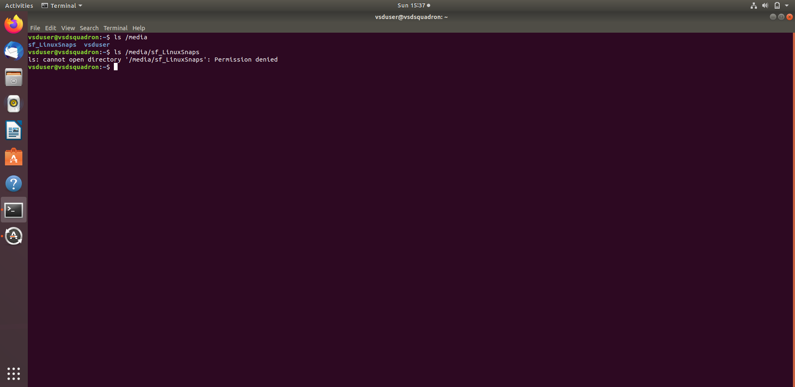
    So I had to run "sudo usermod -aG vboxsf $USER" this is the command to become the user and access the folder. I dont have the whole process as in forgot to take the SS. But all you need is COMMAND.
    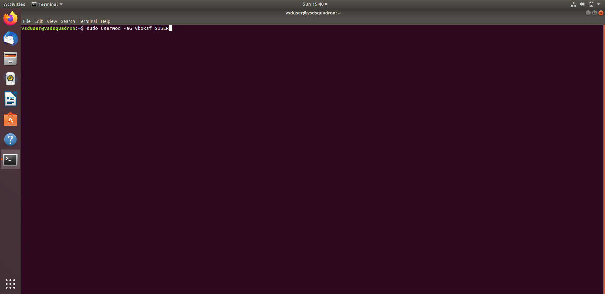

    Then i used "sudo reboot"
    to reboot the server and make it properly work

5. __Accessing the Shared Folder and Copying Files__

    And all set now i can access my linux files in my WINDOWS as well.
    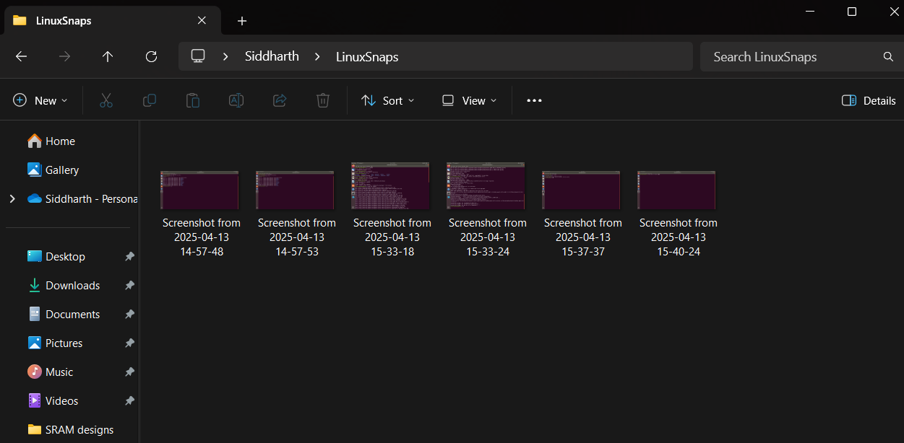

    SO This is how i created the shared folders for my conveninvce i just shared it, so if anyone wants to do it in future they can atleast have something to refer.

## Day 1 

  
<h3>Theory<h3>

  

Checking what tools and files we have access to and what we are going to work with in future. 
These are some tools we have given access to. You can see in designs and there are "pdks" and "openlane" as well let me show you. 

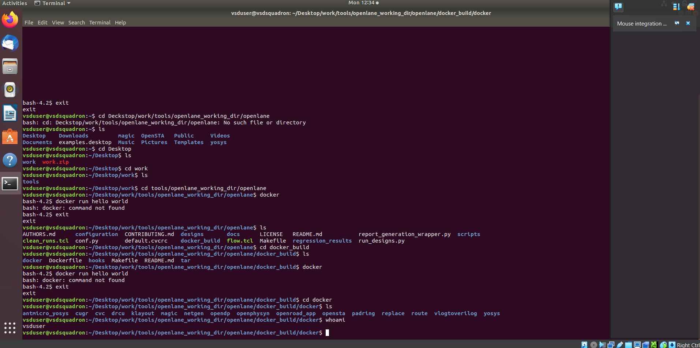
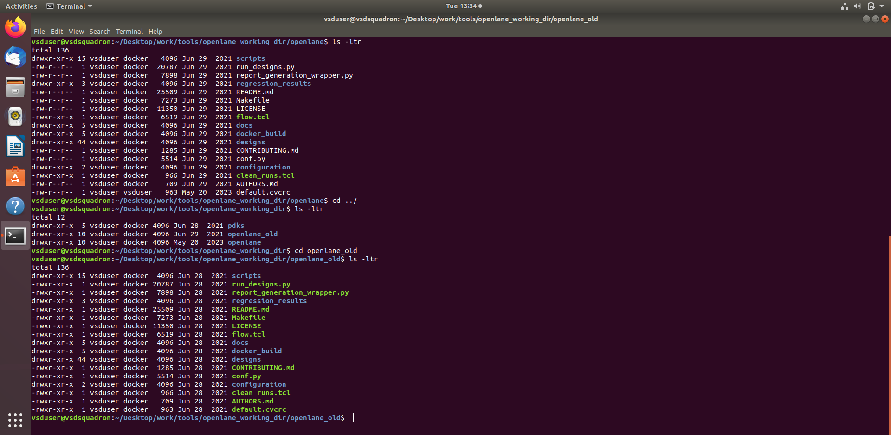

# Starting with Openlane

## __1. Working with openlane__

__Step 1 - Synthesis__

#### Before Synthesis Processess to be done -

    - Design set-up stage - We need to setup a file system specific to the flow as we
    perform the steps we are going to fetch files from the perticular folder/location. 
    This step helps the openlane to fetch the information from single file instead
    fetching it from two different LEF files. So were going to merge the two files
    together which are - lep.lep and Tlep.

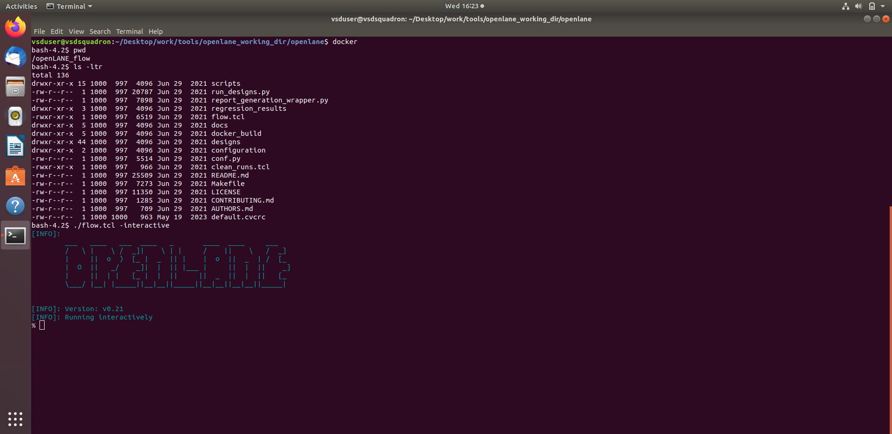

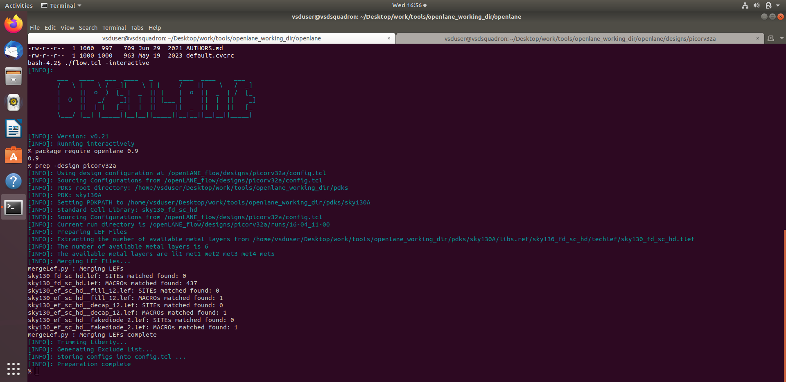

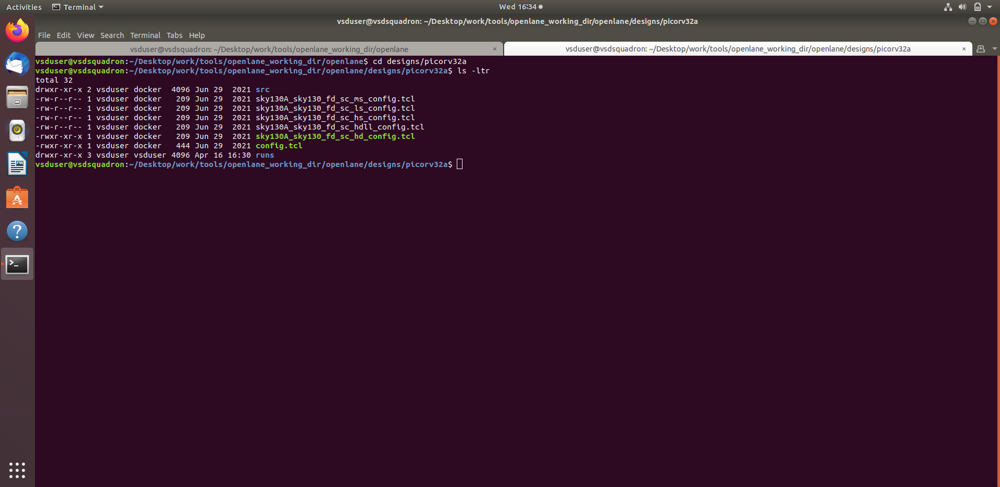

    Now the preperation step is complete.

    - If we open the file that we created it'll give us the "Date file" which stores the
    data. And it has different files on it.

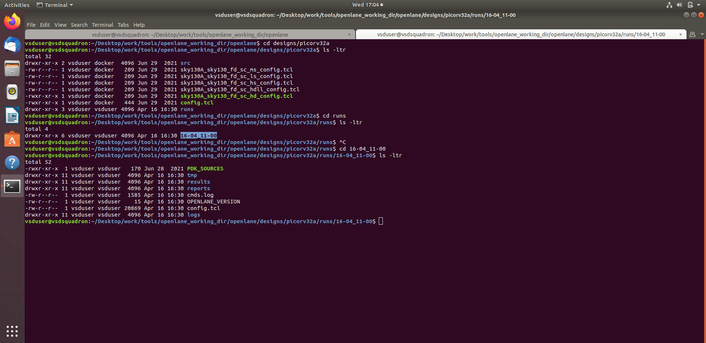

## Flop count 

Flop Ratio = Number of Flip_Flop / Number of cell counts

The counter flip flop ratio is = dfxtp = 1613
The number of cells = 14876

The Flop count = 0.108
Percentage = 10.8

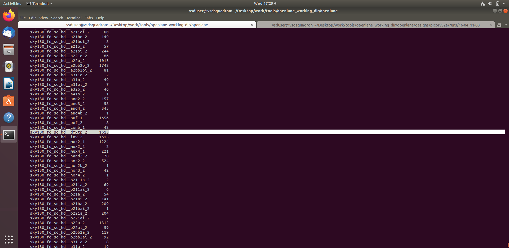

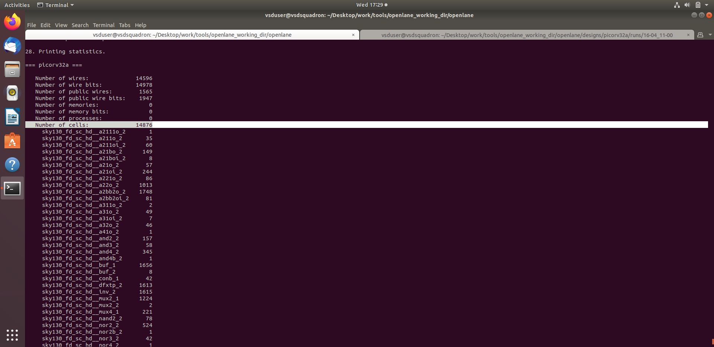

### Here you can see the RESULT and the REPORT by running these commands and the files 
### inside are the whole data of it. 

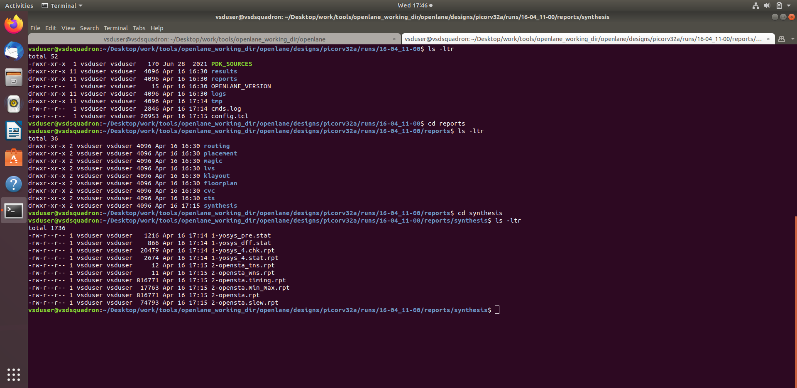

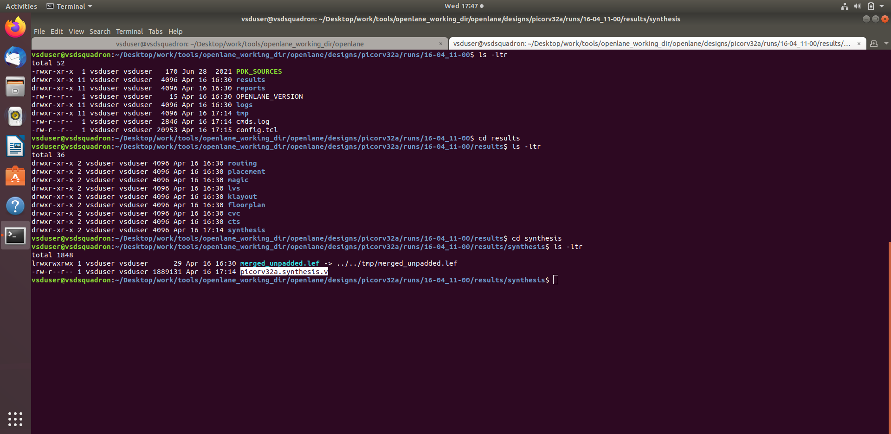

## Now Day 1 comes to the end with this and we are moving on to the next Day from here.
