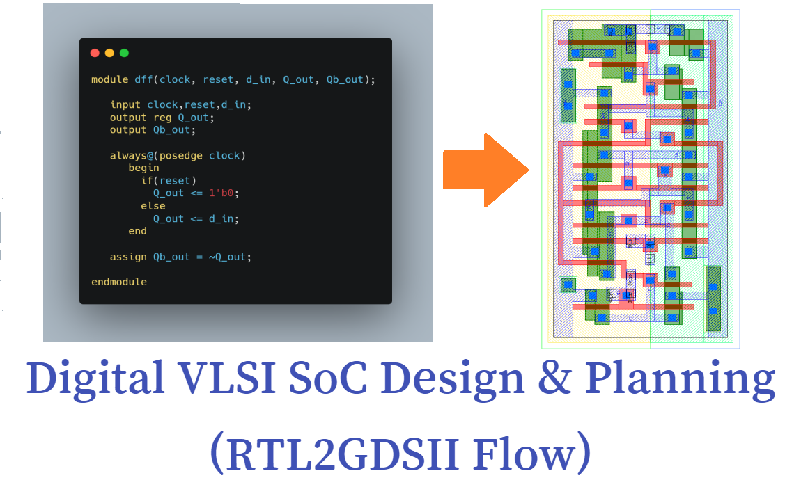

# Dgital VLSI SoC Design and Planning

### Expand to see the process for shared folders in linux and windows
<details>
  <summary><h3>Expand / Creating Shared Folder<h3></summary>

  ## Setting Up Shared Folder Between Windows and Linux VirtualBox

While working on my RISC-V SoC project in the Linux VirtualBox environment, I needed to share screenshots and files from my Linux VM to my Windows system. Here’s exactly what I did, step by step:

1. __Creating a Shared Folder in Windows__

   
    First, I created a separate folder in my Windows system to keep things organized and avoid mixing with other screenshots.
    I planned to use this folder whenever I wanted to move files between Linux and Windows.

    


2. __Configuring Shared Folder in VirtualBox Settings__
   

    - Then, I configured this folder as a shared folder in VirtualBox:
    I completely powered off the virtual machine (not saved state).
    Then I opened VirtualBox > Settings > Shared Folders for my VM and added the Folder.

    
    
    - #### Click on the small "plus file" icon on the right.

    
    
    - #### Then do the simple process shown in the image below to create the folder.
    - #### "MAKE SURE YOUR VM IS COMPLETELY SWITCHED OFF AND NOT IN SAVED STATE"

    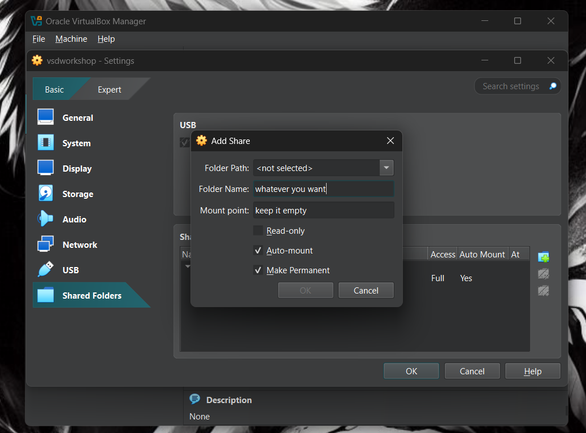

    - #### Just click ok and there you go.

    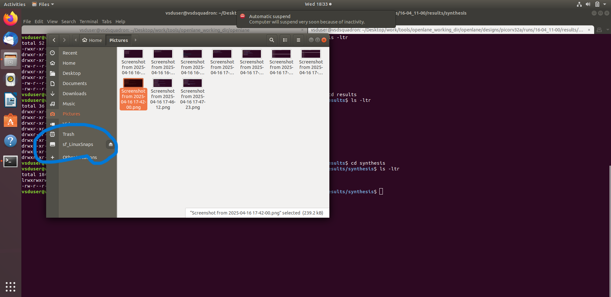

    - #### As you can see there is a folder named LinuxSnaps.

#### Upto this everything should be easy : Next if the problem occurs as it did in mine.

3. __Booting into Linux & Checking the Folder__


    I added the folder but i wasn't been able to see it in my linux windows 
    SO i used this command to create the directory but it failed by saying file already exist.
    To proceed further i needed to make sure that VirtualBox Guest Additions are installed in my Linux VM. This is necessary for shared folders to work.

    Then i used this commands:
    sudo apt update
    sudo apt install virtualbox-guest-utils
    Reboot the Virtual Machine: After installation, reboot your Linux VM by typing:
    sudo reboot
    
    After starting the Linux VM again, I ran:
    
    


4. __Fixing the Permission Denied Issue__


    After that process i got the folder running in my linux but it was denying the permission when i tried to move the screenshot in that folder
    
    So I had to run "sudo usermod -aG vboxsf $USER" this is the command to become the user and access the folder. I dont have the whole process as in forgot to take the SS. But all you need is COMMAND.
    

    Then i used "sudo reboot"
    to reboot the server and make it properly work


5. __Accessing the Shared Folder and Copying Files__


    And all set now i can access my linux files in my WINDOWS as well.
    

    SO This is how i created the shared folders for my conveninvce i just shared it, so if anyone wants to do it in future they can atleast have something to refer.

</details>


<hr>

## Day 1 - Inception of open-source EDA, OpenLANE and Sky130 PDK

<details>
  <summary><h3>Theory - Click "Theory" to expand.<h3></summary>

- ##### Packiging
    In The Embedded Boards we can see the chip is implanted. As we think it's a real chip but wait that's not it - IT'S NOT A ACTUAL CHIP , BUT IT'S ONLY A PACKAGE OR WE CAN SAY A CASE TO SAVE THE ACTUAL CHIP WHICH IS INSIDE OF THAT PACKAGE. The actual chip is made of silicon and it cannot be touched by bare hands so that's why it's packed with plastic layer. The connections from package is fed to the chip by __WIRE BOUND__ method which is none other than basic wired connection.

    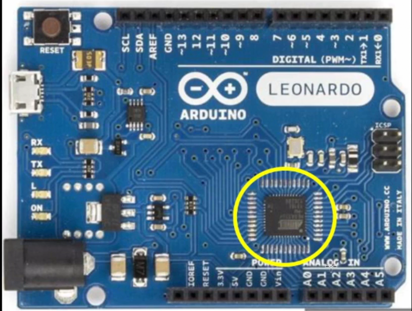

    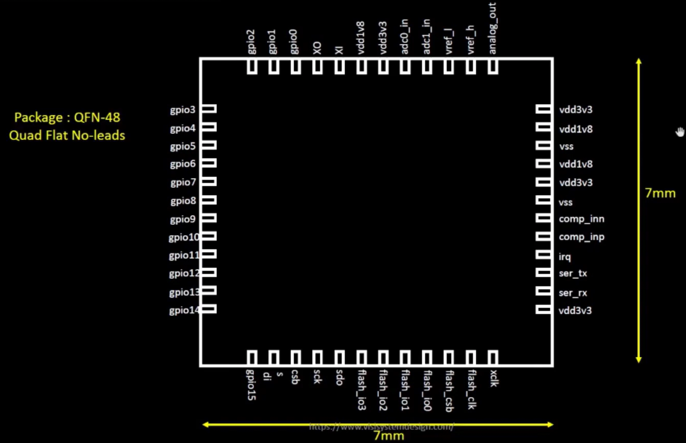

    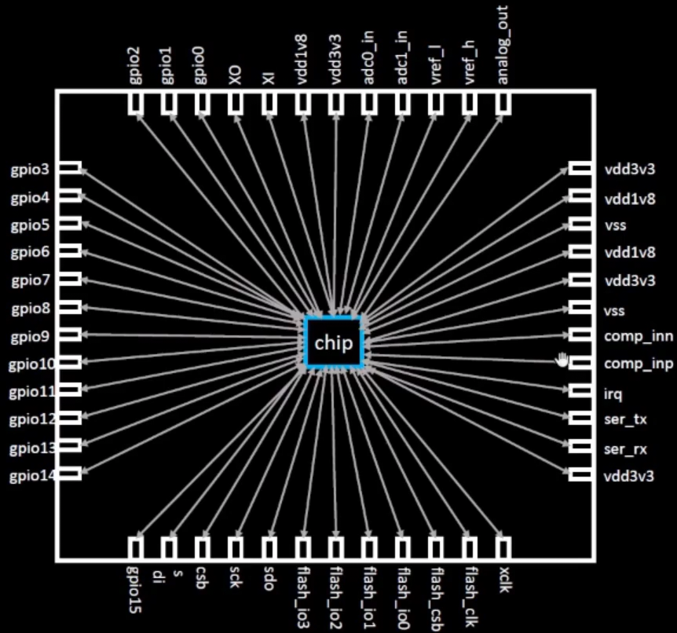


- ##### Chip
    Now, Inside the chip, all the signals from the outside to the chip and from inside are passed through PADS. The area bound by the pads is CORE where all the digital logic of the chip is placed. Both the core and pads make up the DIE which is the basic manufacturing unit in regards to semiconductor chips.

    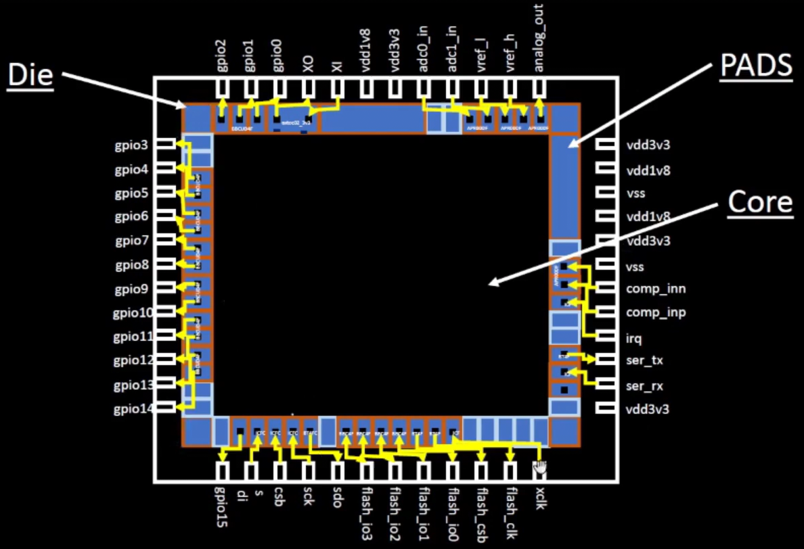


- ##### FOUNDRY 
    It is the place where the semiconductor chips are manufactured, This Foundries should be _CLEAN_ The word clean here dosen't mean like what we do in our house, it should not have even single particle of dust or any human part like hairs. FOUNDRY IP's are Intellectual Properties based on a specific foundry and these IP's require a specific level of intelligence to be produced whereas, repeatable digital logic blocks are called MACROS.

    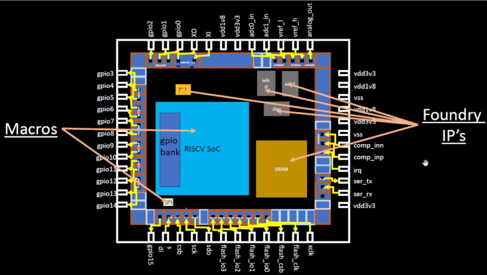


- ##### ISA (Intruction Set Architecture)
    A C program which has to be run on a specific hardware layout which is the interior of a chip in your laptop, there is certain flow to be followed.
    Initially, this particular C program is compiled in it's assembly language program which is nothing but RISC-V ISA (Reduced Instruction Set Compting - V Intruction Set Architecture).
    Following this, the assembly language program is then converted to machine language program which is the binary language logic 0 and 1 which is understood by the hardware of the computer.
    Directly after this, we've to implement this RISC-V specification using some RTL (a Hardware Description Language). Finally, from the RTL to Layout it is a standard PnR or RTL to GDSII flow.

    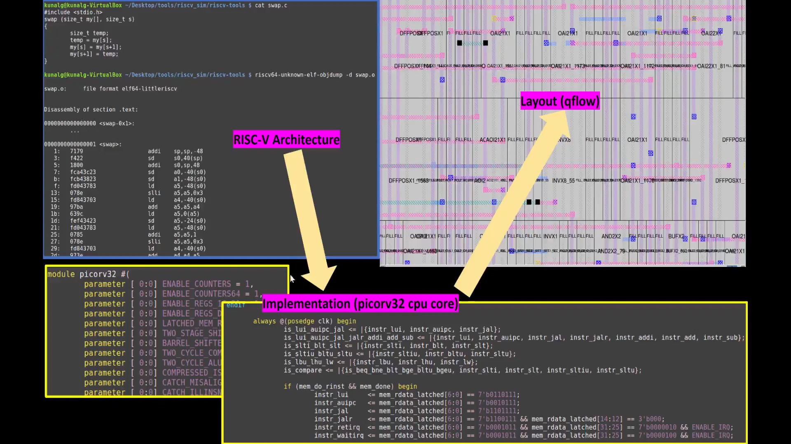


    For an application software to be run on a hardware there are several processes taking place. To begin with, the apps enters into a block called system software and it converts the application program to binary language. There are various layers in system software in which the major layers or components are OS (Operating System), Compiler and Assembler.
    At first the OS outputs are small function in C, C++, VB or Java language which are taken by the respective compiler and converted into instructions and the syntax of these instructions varies with the hardware architecture on which the system is implemented.
    Then, the job of the assembler is to take these instructions and convert it into it's binary format which is basically called as a machine language program. Finally, this binary language is fed to the hardware and it understands the specific functions it has to perform based on the binary code it receives.

    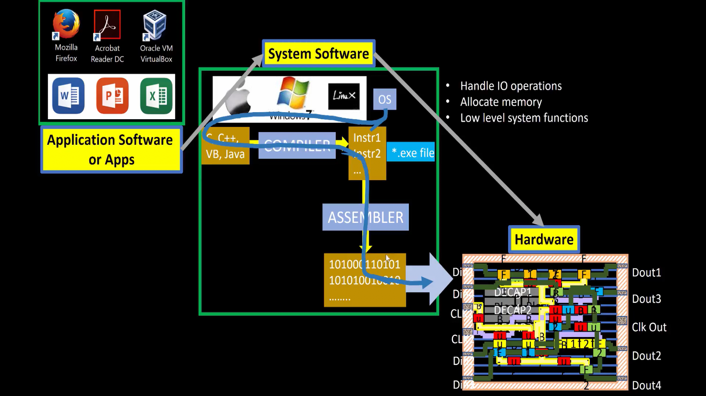

    For example, if we take a stopwatch app on RISC-V core, then the output of the OS could be a small C function which enters into the compiler and we get output RISC-V instructions following this, the output of the assembler will be the binary code which enters into your chip layout.

    

    For the above stopwatch the following are the input and output of the compiler and assembler.

    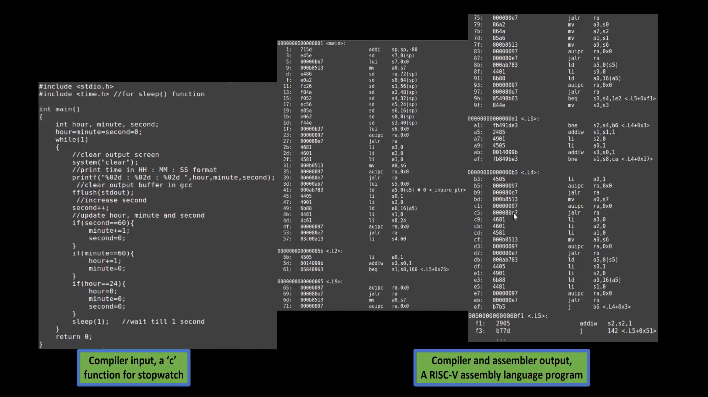

    The output of the compiler are instructions and the output of the assembler is the binary pattern. Now, we need some RTL (a Hardware Description Language) which understands and implements the particular instructions. Then, this RTL is synthesised into a netlist in form of gates which is fabricated into the chip through a physical design implementation.

    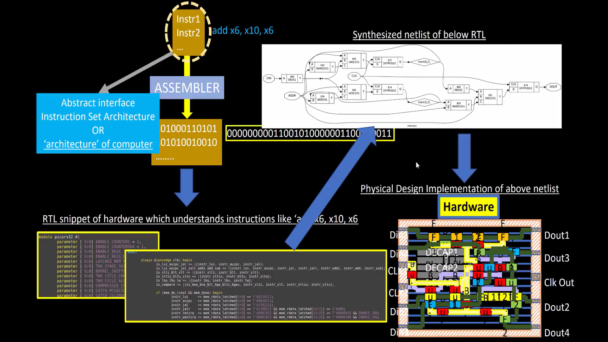

    There are mainly 3 different parts in this course. They are:
    RISC-V ISA
    RTL and synthesis of RISC-V based CPU core - picorv32
    Physical design implementation of picorv32

    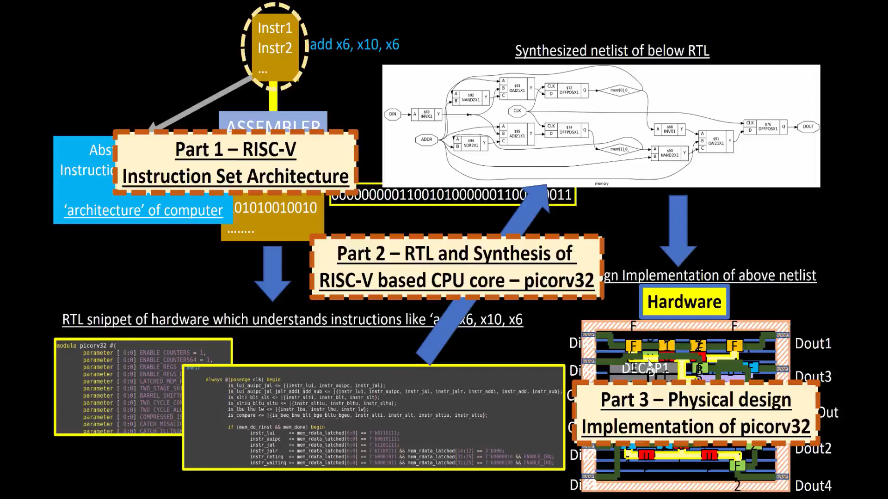

    Open-source Implementation
    For open-source ASIC design implemantation, we require the following enablers to be readily available as open-source versions. They are:-
    RTL Designs
    EDA Tools
    PDK Data
    Initially in the early ages, the design and fabrication of IC's were tightly coupled and were only practiced by very few companies like TI, Intel, etc.
    In 1979, Lynn Conway and Carver Mead came up with an idea to saperate the design from the fabrication and to do this they inroduced structured design methodologies based on the λ-based design rules and published the first VLSI book "Introduction to VLSI System" which started the VLSI education.
    This methodology resulted in the emergence of the design only companies or "Fabless Companies" and fabrication only companies that we usually refer to as "Pure Play Fabs".
    The inteface between the designers and the fab by now became a set of data files and documents, that are reffered to as the "Process Design Kits (PDKs)".
    The PDK include but not limited to Device Models, Technology Information, Design Rules, Digital Standard Cell Libraries, I/O Libraries and many more.
    Since, the PDK contained variety of informations, and so they were distributed only under NDAs (Non-Disclosure Agreements) which made it in-accessible to the public.
    Recently, Google worked out an agreement with skywater to open-source the PDK for the 130nm process by skywater Technology, as a result on 30 June 2020 Google released the first ever open-source PDK.

    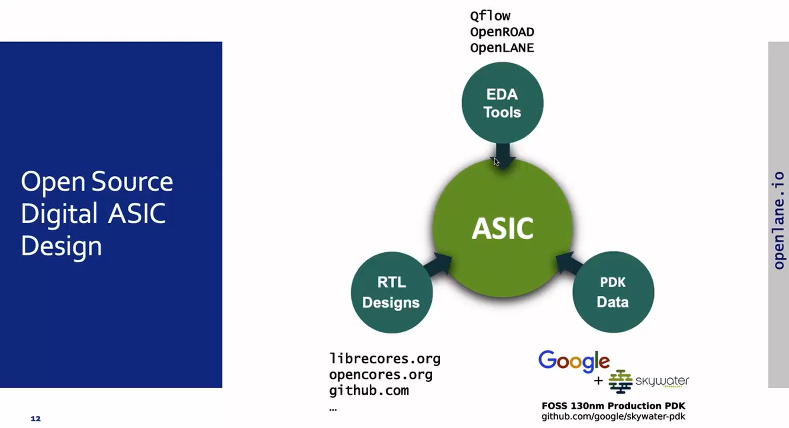


    ASIC design is a complex step that involves tons of steps, various methodologies and respective EDA tools which are all required for successful ASIC implementation which is achieved though an ASIC flow which is nothing but a piece of software that pulls different tools togather to carry out the design process.
    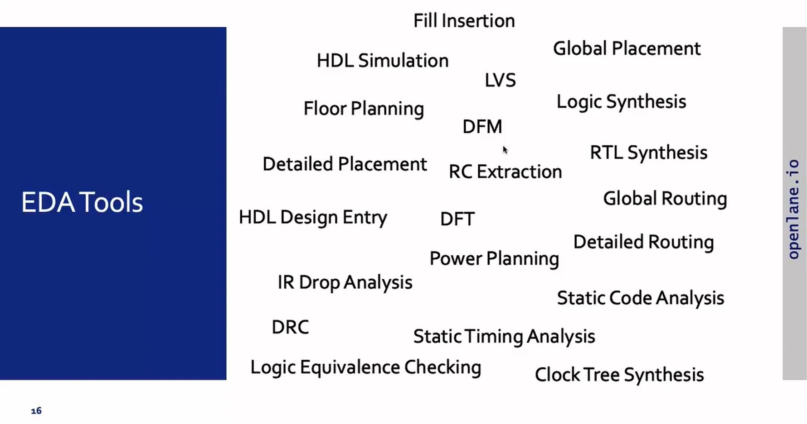


    OpenLANE Open-source ASIC Design Implementation Flow
    The main objective of the ASIC Design Flow is to take the design from the RTL (Register Transfer Level) all the way to the GDSII, which is the format used for the final fabrication layout.
    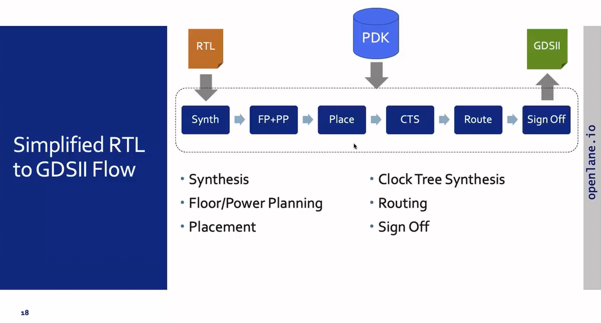

    Synthesis is the process of convertion or translation of design RTL into circuits made out of Standard Cell Libraries (SCL) the resultant circuit is described in HDL and is usually reffered to as the Gate-Level Netlist.
    Gate-Level Netlist is functionally equivalent to the RTL.
    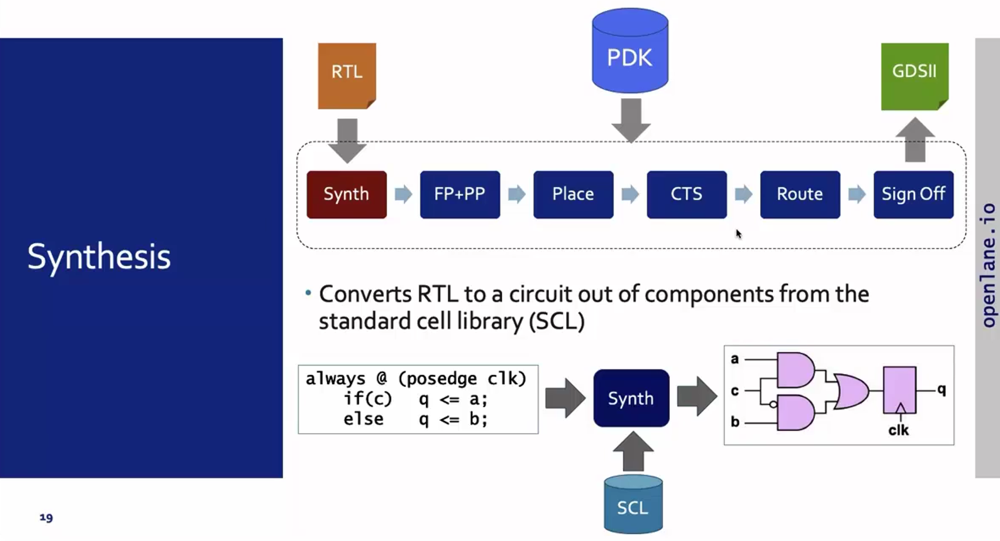

    The fundemental building blocks which are the standard cells have regular layouts.
    Each cell has different views/models which are utilised by different EDA tools like liberty view with electrical models of the cells, HDL behavioral models, SPICE or CDL views of the cells, Layout view which include GDSII view which is the detailed view and LEF view which is the abstract view.
    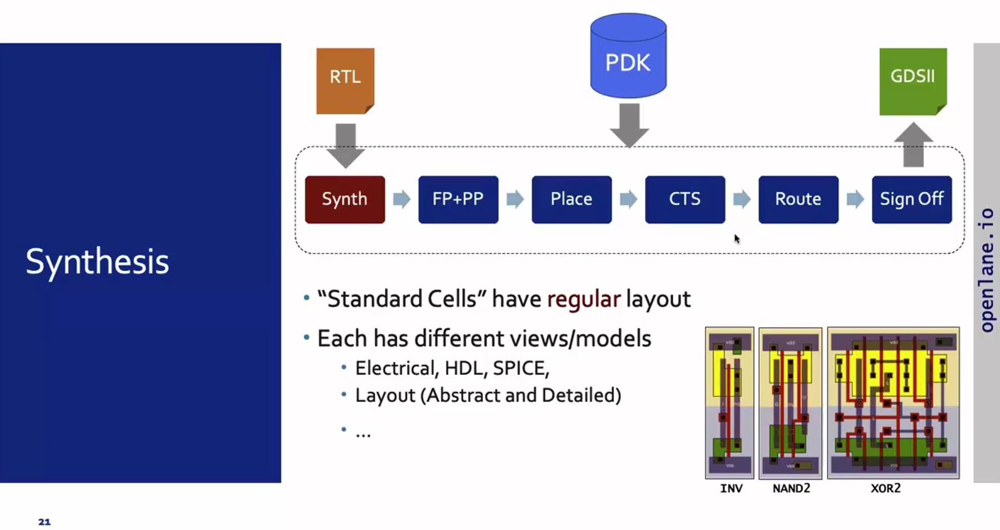

    Chip Floor Planning
    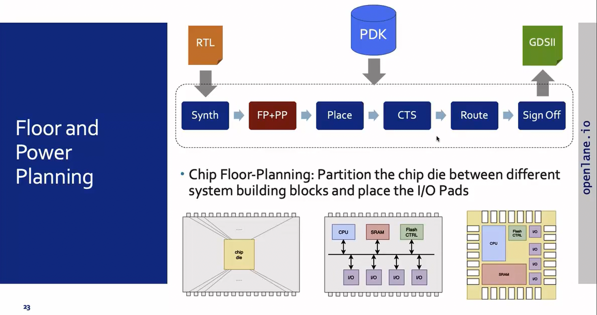

    Macro Floor Planning
    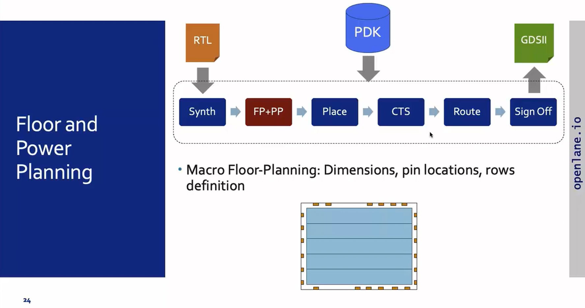

    Power Planning typically uses upper metal layers for power distribution since thay are thicker than lower metal layers and so have lower resistance and PP is done to avoid electron migration and IR drops.
    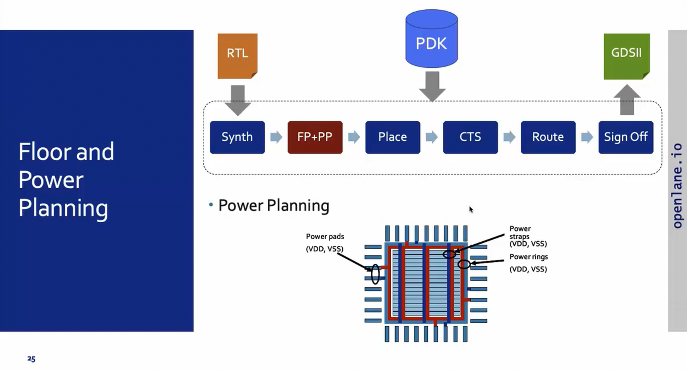

    Placement
    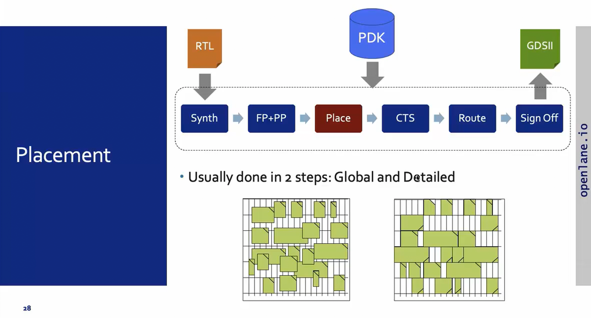

    Global placement provide approximate locations for all cells based on connectivity but in this stage the cells may be overlapped on each other and in detailed placement the positions obtained from global placements are minimally altered to make it legal (non-overlapping and in site-rows)
    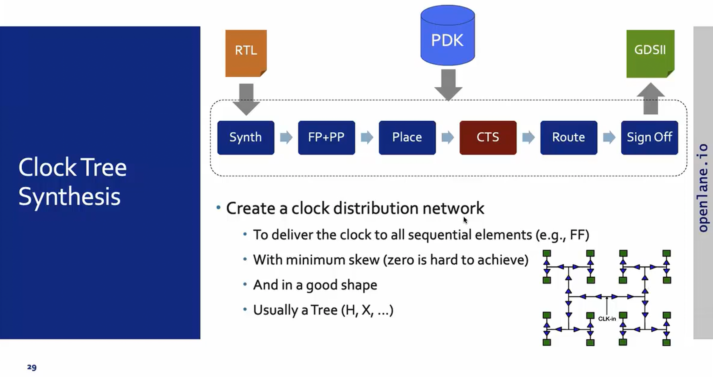

    Clock Tree Synthesis
    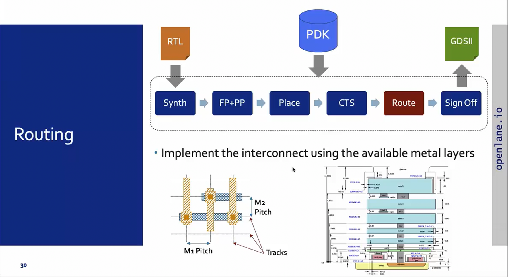

    Clock skew is the time difference in arrival of clock at different components.
    Routing
    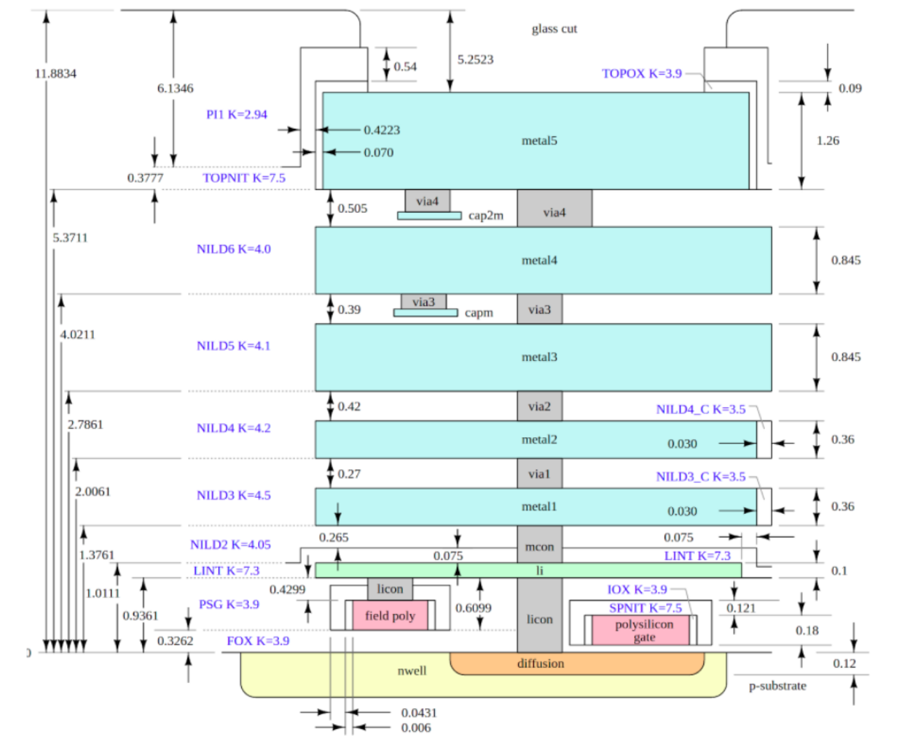

    skywater PDK has 6 routing layers in which the lowest layer is called the local interconnect layer which is a Titanium Nitride layer the following 5 layers are all Aluminium layers.
    stackup

    Global and Detailed Routing
    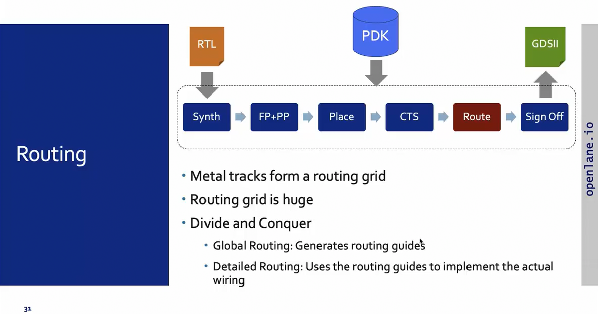

    Once done with the routing the final layout can be generated which undergoes various Sign-Off checks.
    Design Rules Checking (DRC) which verifies that the final layout honours all design fabrication rules.
    Layout Vs Schematic (LVS) which verifies that the final layout functionality matches the gate-level netlist that we started with.
    Static Timing Analysis (STA) to verify that the design runs at the designated clock frequency.
    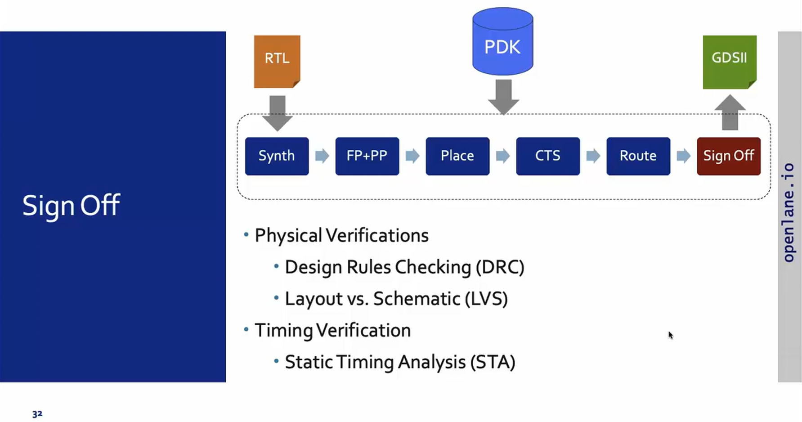
  

</details>

<hr>

Checking what tools and files we have access to and what we are going to work with in future. 
These are some tools we have given access to. You can see in designs and there are "pdks" and "openlane" as well, let me show you. 

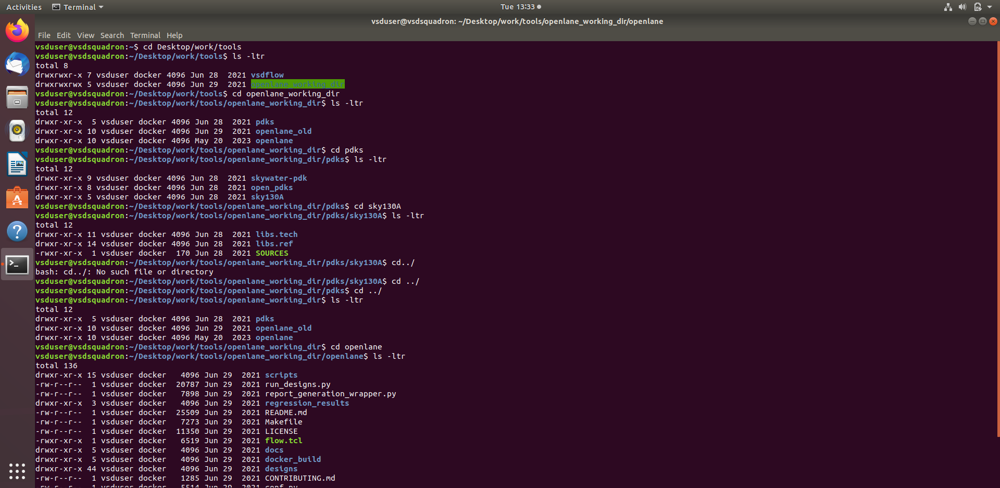
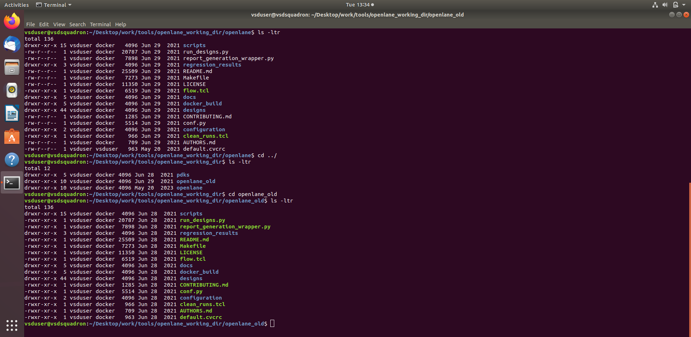

<hr>

# Starting with Openlane

## Implementation

<h4> Objectives <h4>

##### 1.Run Desing Synthesis for "picorv32a" using OpenLANE & generate necessery outputs.
##### 2.Calculate the Flop ratio

- __Formula__ 

```
                Number of D Flip Flops 
Flop Ratio =   —————————————————————————
                Total Number of Cells

Percentage of DFF's = Flop Ratio × 100
```

<hr>

#### 1.Run Desing Synthesis for "picorv32a" using OpenLANE & generate necessery outputs.
##### Commands to invoke the OpenLANE flow and perform synthesis.
```bash
# As we work in Openlane we have to first change our directory to openlane flow directory. Just type -

cd Desktop/work/tools/openlane_working_dir/openlane

# alias docker ='docker run -it -v $(pwd):/openLANE_flow -v $PDK_ROOT:$PDK_ROOT -e PDK_ROOT=$PDK_ROOT -u $(id -u $USER):$(id -g $USER) efabless/openlane:v0.21'
# aliased basically means creating the short version of the command so we don't have to type very long command all the time.
# So using only 'docker' we can invoke the OpenLANE flow docker sub-system.

command - docker

# After running docker the "bash" directory will get opened where we're gonna work
```

```bash
# As we've entered the OpenLANE flow contained docker sub-system we can invoke the OpenLANE flow in the Interactive mode using the following command
./flow.tcl -interactive

# Now use this command to open the required package
package require openlane 0.9

- Processess to be done Before Synthesis -
# Now the OpenLANE flow is ready to run any design and initially we have to prep the design creating some necessary files and directories for running a specific design which in our case is 'picorv32a'

# Design set-up stage - We need to setup a file system specific to the flow as we perform the steps we are going to fetch files from the perticular folder/location. 

# This step helps the openlane to fetch the information from single file instead fetching it from two different LEF files. So were going to merge the two files together which are - lep.lep and Tlep.

prep -design picorv32a

# Now that Preperations are done , we can run synthesis using following command
run_synthesis

# Exit from OpenLANE flow
exit

# Exit from OpenLANE flow docker sub-system
exit
```
<hr>

1. Preperation Step


You can see there is a new folder is added named _"runs"_

Now the preperation step is complete.

- If we open the file that we created it'll give us the "Date file" which stores the
data such as "results","report".

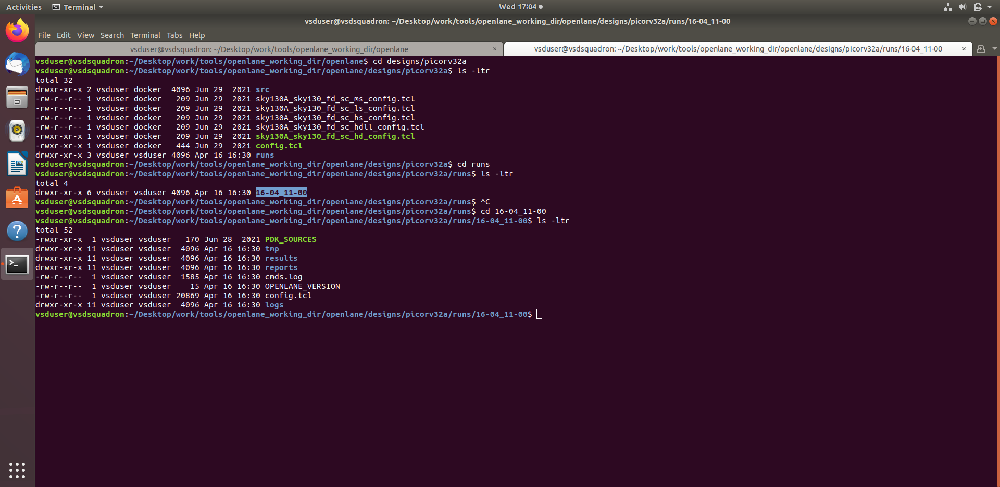

<hr>

2. Synthesis Process 

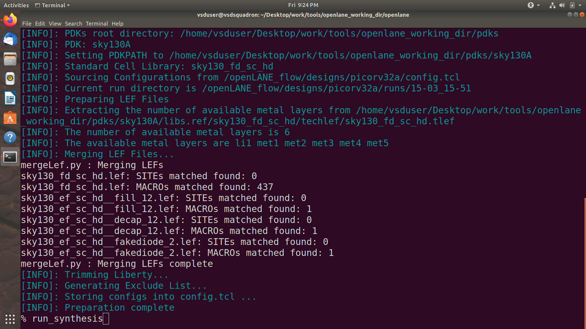

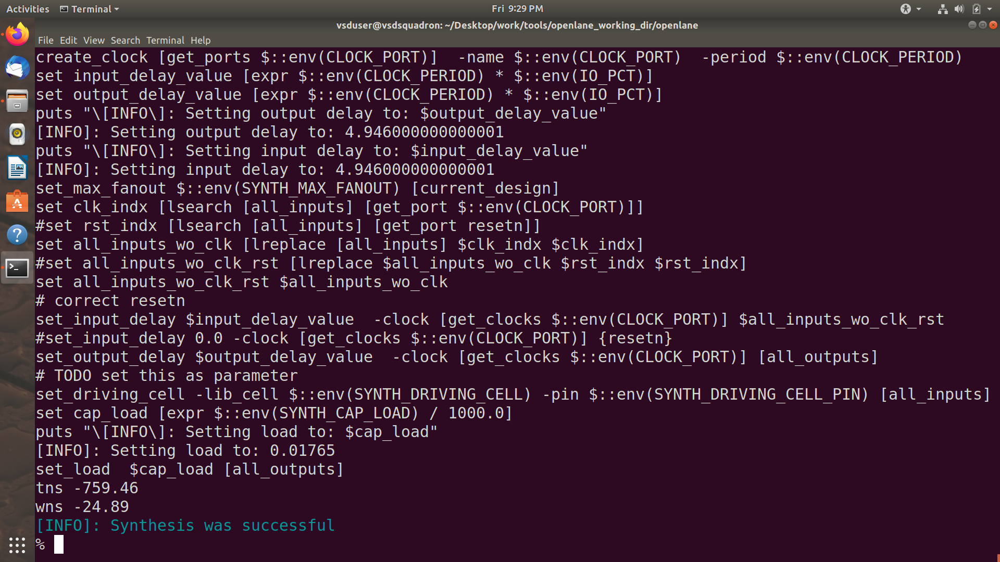


- ### Flop count 


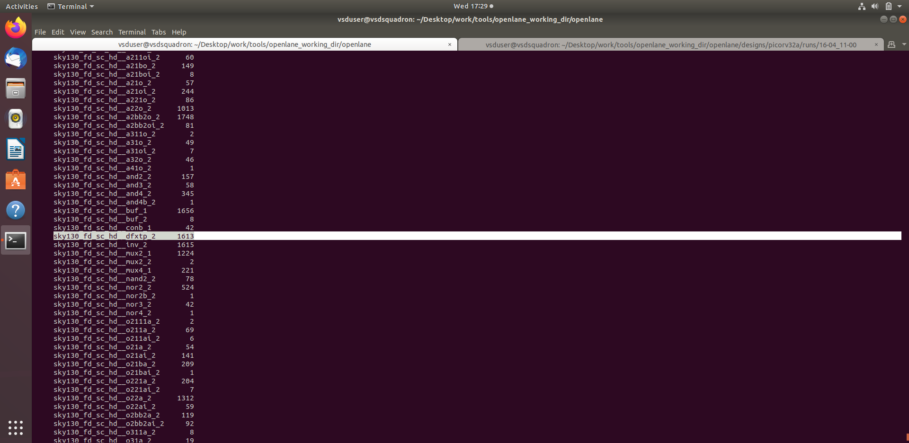


```
               1613
Flop Count =  ——————— = 0.108429685
               14876

Percentage of DFF's = 0.108429685 x 100 = 10.8429685 %
```

### Here you can see the RESULT and the REPORT by running these commands and the files 
### inside are the whole data of it. 


.
.
.
.
.
### Day 1 comes to the end with this and we are moving on to the next Day from here.

<hr>

## Day 2 - Good floorplan vs bad floorplan and introduction to library cells

<details>

  <summary><h3>Theory - Click here to understand the process</h3></summary>

### 1. Define Height and width of core and Die.

- Basic netlist
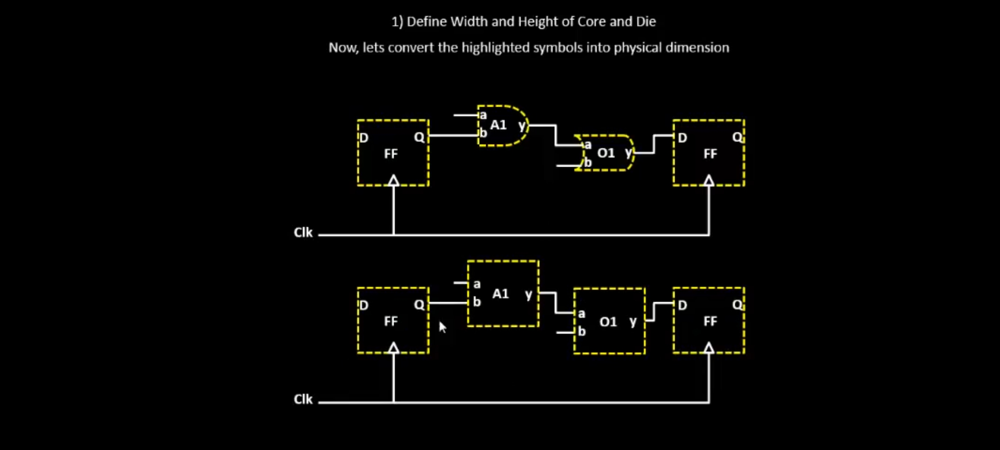

FF - flip flop | A1 & O1 - Standard cells like AND, OR, INVERTER.

- We're taking this one netlist you can see in the image above as an example
Netlist define the connectivity between all the components 

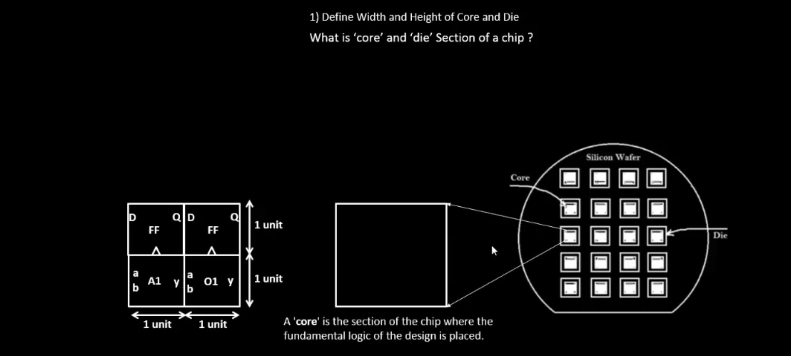

- Each cell has Area of 1sq unit and when we connect them together,
The Total Area is - 4 squnit. 

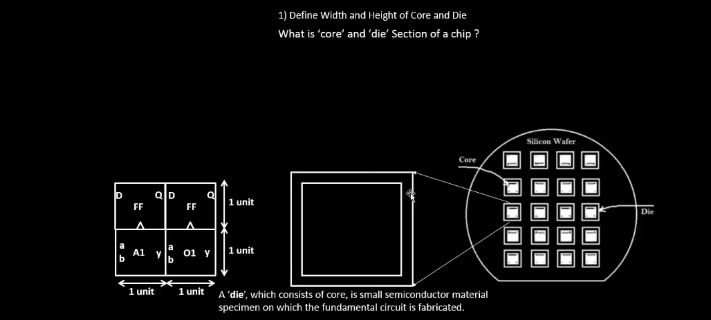

- As you can see in the image the circular area is a silicon wafer and it has multiple cells on it and these cells are called _Die_ and the Die is made up of _Core_

__core__ : A core is a the section of the chip where the fundamental logic of the design is placed.

__Die__  : A die consist of core is a small semiconductor material speimen on which the fundamental circuit is fabricated.The DIE encapsulates the core.

- How to arrive on dimensions ? 

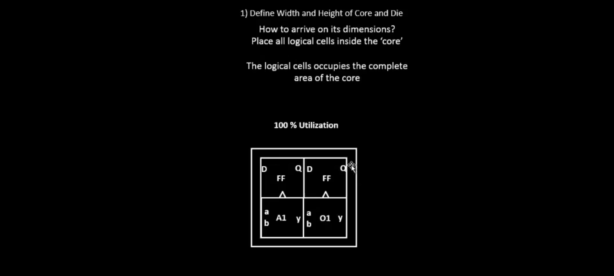
```
                          Area occupied by Netlist
Utilization Factor =    —————————————————————————————
                          Total Area of the core
```

When the Utilization Factor is equal to 1.

It means that our core is fully occupied and we canno't add any extra cell,
so normally we go for 50% or 60% Utilization and not 100%

```
                 Height
Aspect Ratio =  ────────
                 Width
```

- When the aspet ratio is one, it signifies that the core is __SQUARE__ Shaped and whenever the Aspect ratio is not 1 it signifies that the chip is __Rectangular__.

- When the Utilization factor is anything other than the 1 then it suggests that the core is not fully utilized and we can add extra cells to it.

- Here you can see the diagram explanation for better understanding.
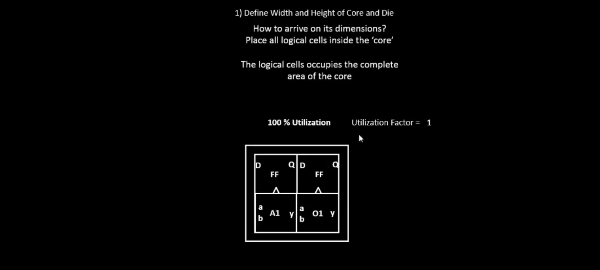
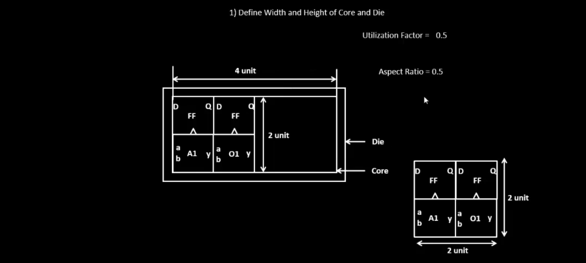
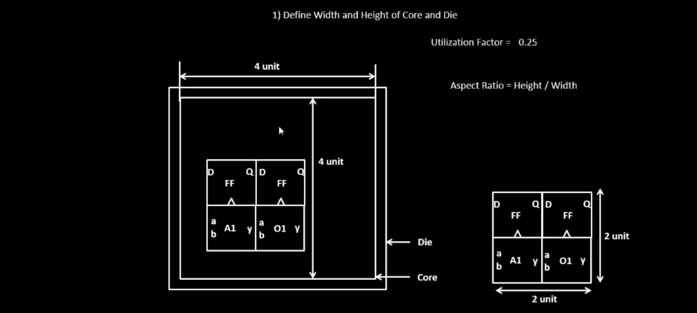

- Now for example if we put our 2x2 core (netlist) into the 4x4 chip then the Utilization Factor = 0.25.

```
                      Area occupied by Netlist    2x2      4
Utilization Factor = ————————————————————————— = ————— = ————— = 0.25
                      Total Area of the core      4x4      16
```

- This suggest that the area occupied by the initial Netlist is 0.25 and 0.75 Area is free for Optimization.
- The Netlist is completely connected by ideal wires which don't have any shape and size.

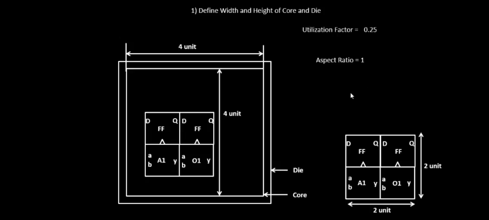

<hr>

### 2. Define Locations of the _Pre-Placed_ or _Macros_ cells.

- As you can see in the image below - it's a chip and we have to decide some specific location for our logic on this chip. Which once decided we cannot change the location  later.
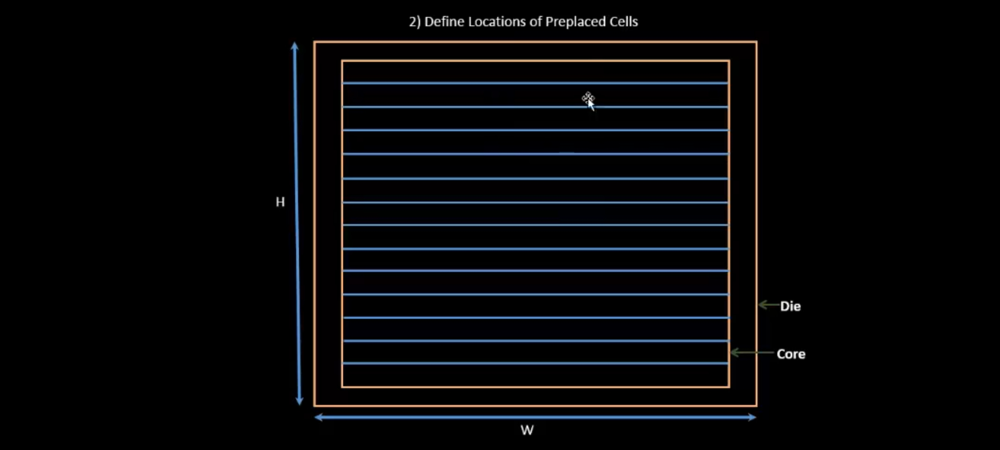

- This logic can be any complex circuit ex - Complex MUX or Any complex logic which will perform very huge tasks. This logic/circuit is the main function of our core and we implement this circuit only once and use it multiple times [i am talking about it's functionality not the actual logic]
- As you can see in the image below we have taken one logic as an example.

- We can split/cut this main circuit into two blocks and implement them seperately.

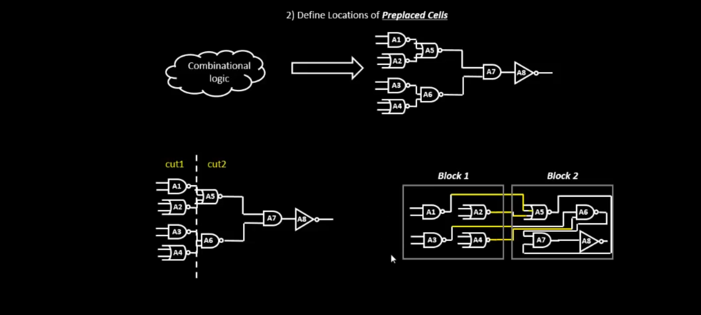

- Now, we can extend the pins of the input side and output side of the circuit after setteling it inside two blocks. As you can see in the image below and what is going on inside is not visible from outside you can see only pins and not the content inside the blocks.

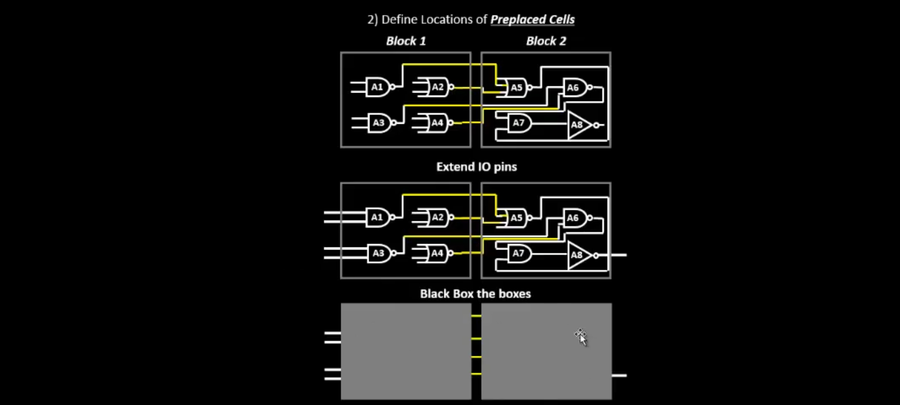

- Now, we seperate this two blocks and we can have two seperate Blocks/circuits which have output and input pins, You can see it in the image below.

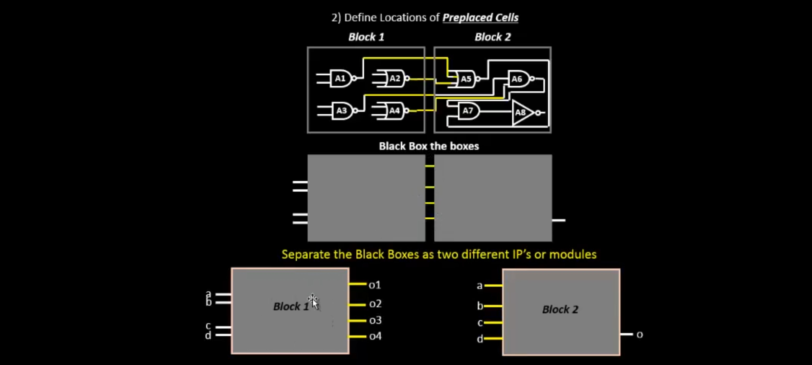
- These two circuits behave as different circuits.
- And instead of implementing the whole logic together which is very complex, we implement them in parts which makes it very easier and faster and after that we can connect this blocks together using their input and output ports multiple times.
- And we use this blocks on the top NETLIST by implementing them _Only Once_.

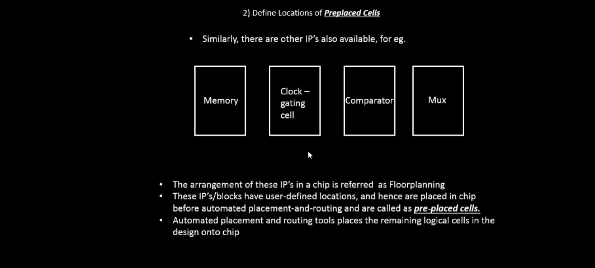

- This blocks have predefined locations on the main chip and that's why this are called _Pre Placed Cells_, As these cells get placed before any automated placing or routing.
- Once the location of this cells is fixed they cannot be moved or touched by any automated routing tools. 
- This blocks are also called MACAROS or IC'S.

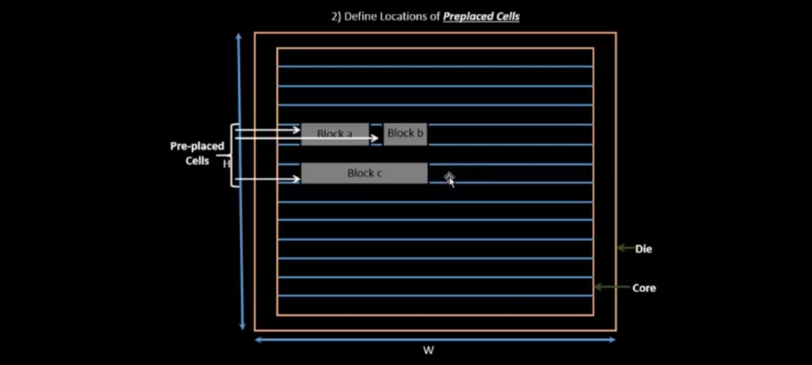

<hr>

### 3. Sorrounding Pre-Placed cells with _Decoupler Capacitor_.

- #### Conditions needs to be fulfilled.

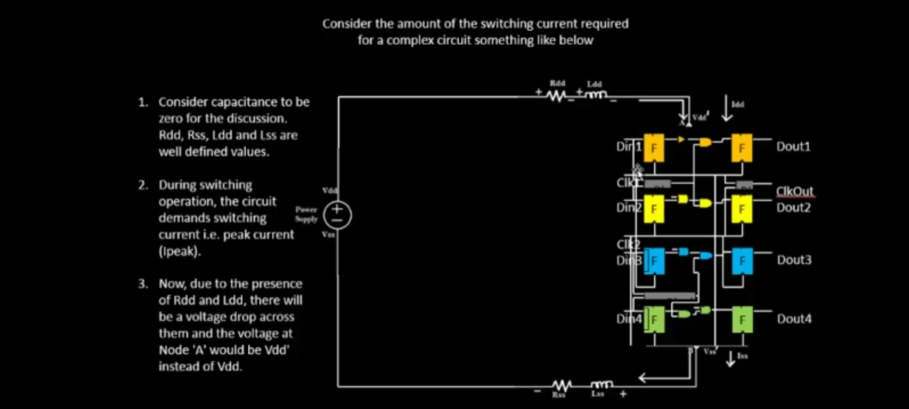

- When the circuit is switching from logic 0 to logic 1 the capacitance between(Inside the circuit on the right side) the circuit needs to be charged by the vdd.
- And, When the circuit is switching from logic 1 to logic 0 the capacitance between the circuit needs to be discharged by the vss(ground).
- But, The problem is that the power supply is connected to the circuit using the wires and wires have some resistance and inductance to them so multiple times voltage drop happens which is not ideal for our condition.
- When the voltage lies between Vil and Vol the logic becomes 0.
- When  the voltage lies between Voh and Vih the logic becomes 1.
- But, When the logic is inside the undefined region which Vih and Vil - it can go either way [logic 1 or logic 0] and we don't certainly know what it'll be and that's not good for our circuit. As you can see in the image 
[ The image might be blurry so apologies for that.]

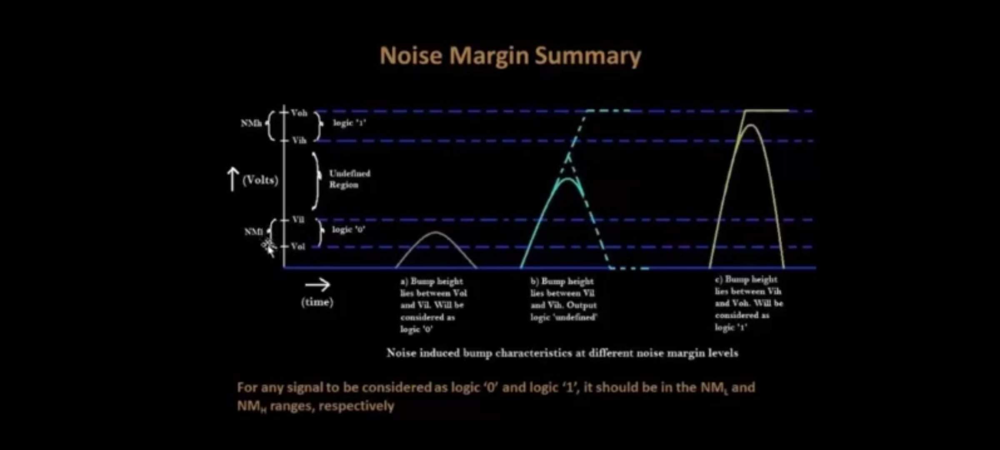

- So here comes the Decoupling capacitor.

- What are _Decoupling Capacitors_ ?
---> The __Decoupling Capacitors__ are local electrical energy reservoirs which provides a bypass path for transient currents. They are placed between power line and ground to the circuit that current is to be provided. When used as decoupling capacitors, they oppose quick changes of voltage. If the input voltage suddenly drops, the capacitor provides the energy to keep the voltage stable.

- It basically means that the power supply is connected to the circuit using the wires and wires have some resistance and inductance to them so the current sometimes drop which is not ideal for our condition so to remove this problem we use these capacitors which are charged and when there is need for the power to the circuit they join the game. They get discharged after using the power and then they get pre charged from power supply.

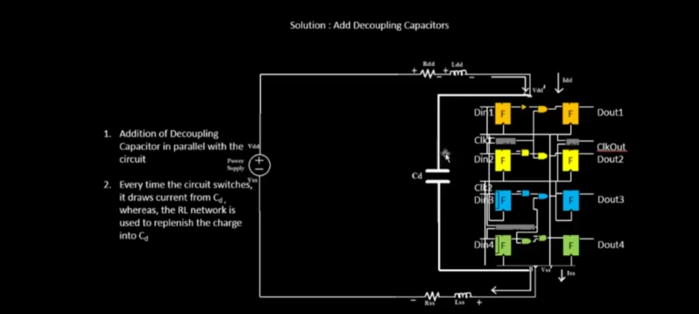

In the image above you can see there is a capacitor in parallel to the circuit.


And This we we make sure our circuit is well designed for working efficiently.

<hr>

### 4. Power Planning

In the power planning we will see that how the power planning is done for more efficient chip design.

As we can see this is our circuit which we are designing and we call it "MACRO"


Now this circuit, which we also call MACRO we consider it as a black box.


Now this macro is being repeated many times in the chip we take it as a example let's say it's repeating 4 times in our circuit.


If you can see in the above image there is driver and load in the circuit and there is a 16-bit BUS which connects the driver OUTPUT to the LOAD and we have to make sure that the signal from driver reaches to the load with same capacity.

Now the problem is that - 

We are using the same power supply to every black box or we can say MACRO as a VDD. Here the blue line shows the VDD and the grey line shows the VSS/Ground. 

Now let's suppose the 16-bit BUS is sending the signal as logic "0" or logic "1" so this BUS has to retain this value until this value reaches to the LOAD. 
In the circuit we can see that every block or MACRO has a decoupling capacitor but the BUS does not its because it is not physically possible to use decoupling capacitor in the circuit everywhere.


Now this 16-bit BUS is made up of 16 capacitors and each capacitor is connected to the VDD or Ground based on the value which DRIVER is sending to the LOAD. And this value is then connected to the INVERTER in the end which inverts all the values which the BUS is carrying.


- WHAT PROBLEM IT CREATES ?

- As the O/P reaches to the input of the LOAD, All the capacitors charged by VDD starts to discharged to the ground and Vice Versa. 
- When all the capacitors discharge their charges and connects to the ground at the same time to the one and only ground line it creates the scenario called __GROUND BOUNCE__ .
If this bump gets into the undefined _NOISE MARGINE_ it can create a very big problem.


This same thing happens to the VDD line and it creates the __VOLTAGE DROOP__. 
So here the voltage levels changes from the ideal 1 to 0 and 0 to 1 and this problem happens because of only one voltage supply.


- __Problem Solving__ :


This problem can be solved by using multiple voltage and ground lines or supplies. This way whichever component needs the supply it can take it from the nearest supply line. As you can see there are vertical and horizontal lines on the chip area.s
and this scenario on the chip created the MESH.

- POWER MESH :


<hr>

### 5. Pin Placement 

Lets take an design that we are going to implement on our chip it has pre-placed cells in it and we're going to make this circuit accroding to the placment of this pre-placed cells.
This connectivity of the circuit is defined in VHDL and this specific connectivity of the gates is called "NETLIST"
NETLIST = Connectivity Information between defferent gates.

Now as you can see in the image below we have two different designs with different inputs and outputs and clocks i/p and o/ps.
We then connect this two designs together using the wires to make our main circuit and then we are going to place this circuit on our chip so that the inputs will come closer to their desired locations. 


If you see in the image below you can see that the Din4 is placed in the start because it goes to the __BLOCK A__ which is already placed and it's location cannot be changed so we have to keep that in mind when we create the new circuit over this "BLOCKS". Now for __BLOCK B__ we can use the buffers to connect it to clkout.


So now we have our inputs on the left  side and outputs on the right side of the chip - we can definitely choose the location according to design or designer's choice. so now the input and output pins are placed on empty place. 

If you see all the ports are outside of the "BLOCK" area because nothing can be placed in that area.

The clock ports are bigger in area because clk ports input continuously sends the signal to the flip-flops in the circuit, so these are the ones who drives the whole circuit therefore we have to make their path bigger so they can have lower resistence.
It's also is the same for the clkout as it takes everythig out of the circuit alone therefore it needs lower resistance.

- __BLOCKING__ :

The blocking means covering which is used to block the i/p and o/p port area so that automated placement and routing tool dosen't place any cells in that area so we use "_logical cell placement blockage_" to seal the area ensuring that nothing gets placed near the are of pins. You can see it in the image below.


#### Now with this process our Floorplanning is completed - Now let's see how to place the NETLIST on this floor that we've made.

<hr>

### 1. Binding NETLIST with physical cells.

All the gates and flip-flops you can see on the image have different shapes but in reality those cells are squared shape. 

These all cells [ flip-flops , gates , etc] are stored or we can say are present in one SHELF and we can call it LIBRARY.

So this Library is like a real life library where all kinds of books are present - in this library we have all the Timing information [like delay] present in it. Also it'll have shape and size information in the shell plus it'll have the required condition on which the circuit works - This all information is present in Library.

Also, In this Library we have different properties of the cells like the different size of the cells to create low-resistance if we want and we can choose this sizes of the cells based on the space the chip can afford. 

Here are the images for better understanding -


<hr>

### 2. Placement

Now, we have our floorplan ready with all the inputs, we now have our NETLIST and also the physical view of the logic gates.

And we are going to place this NETLIST on the floorplan. Now we can't put the NETLIST exactly as in the diagram on the FLOORPLAN but because of that reason we have our physical view ready. And now we will do the connection according to the NETLIST.

Now, while placing the physical view on the floor we make sure that the pre-placed cells area won't be touched during this process and we will put the cells in a way that they will come closer to their desired I/P and O/P pins. 
Placement of the cells :

- Section (Orange) - Here, we put the cells directly as the physical view shows.
- Section (Yellow) - Here, we put the cells very close to each other which reduce the delay between them
- Section (Blue) - Here, The Din and Dout are very far from each other and they are in the cross format which makes the placement very   hard so we have to set them properly using buffers for keeping the information signal intact.

- Sectio (Green) - Here it's the same as the section 3 


<hr>

### 3. Optimized Placement

The placement gets so messy after placing the cells so we have to solve this using __Optimized Placement__

Here we can do the Estimation [ to send the actual information from input to the flip-flop we will use Repeators/buffers to sustain the information for a long route ] - So it's like two people are standing on the sides of the river and they are trying to communicate but their voice can't cover the long distance so we use one or two or even three people on the boats and they pass the information to the other side. So this is how the buffers work.
This Process is called __System integrity__.

How the buffers work --> This repeators that we are using will create the replica of the original signal and sends it to the next repeator and that repeator will do the same. This way the signal integrity is maintained - And this process is done by doing the transition analysis to check whether we need the buffer or not. 

Drawback - This process takes too much place.


</details>

## Implementation

#### Objectives :

1. Run 'picorv32a' design floorplan using OpenLANE flow and generate necessary outputs.
2. Calculate the die area in microns from the values in floorplan def.
3. Load generated floorplan def in magic tool and explore the floorplan.
4. Run 'picorv32a' design congestion aware placement using OpenLANE flow and generate necessary outputs.
5. Load generated placement def in magic tool and explore the placement.

```
Area of die in Microns = Die width in Microns x Die height in Microns
```
<hr>

#### 1. Run 'picorv32a' design floorplan using OpenLANE flow and generate necessary outputs.

- Commands to invoke the OpenLANE flow and perform floorplan.

```bash
# Change directory to openlane flow directory
cd Desktop/work/tools/openlane_working_dir/openlane

# alias docker='docker run -it -v $(pwd):/openLANE_flow -v $PDK_ROOT:$PDK_ROOT -e PDK_ROOT=$PDK_ROOT -u $(id -u $USER):$(id -g $USER) efabless/openlane:v0.21'
# Since we have aliased the long command to 'docker' we can invoke the OpenLANE flow docker sub-system by just running this command
docker

```
```bash
# Now that we have entered the OpenLANE flow contained docker sub-system we can invoke the OpenLANE flow in the Interactive mode using the following command
./flow.tcl -interactive

# Now that OpenLANE flow is open we have to input the required packages for proper functionality of the OpenLANE flow
package require openlane 0.9

# Now the OpenLANE flow is ready to run any design and initially we have to prep the design creating some necessary files and directories for running a specific design which in our case is 'picorv32a'
prep -design picorv32a

# Now that the design is prepped and ready, we can run synthesis using following command
run_synthesis

# Now we can run floorplan
run_floorplan
```
- Screenshots of the floorplan run 


<hr>

#### 2. Let's Calculate the die area in microns from the values in floorplan def.
 

- Screenshot of contents of floorplan def


```
According to the floorplan def :

1000 units distance = 1 micron
Die witdth in unit distance = 660685 - 0 = 660685
Die height in unit distance = 671405 - 0 = 671405

                         Value in unit distance 
Distance in microns =  —————————————————————————
                         1000

                        660685
Die width in microns = ———————— = 660.685 Microns
                         1000

                        671405
Die width in microns = ———————— = 671.405 Microns
                         1000
                        
Area of die in microns = 660.685 ∗ 671.405 = 443587.212425
```
<hr>

#### 3. Load generated floorplan def in magic tool and explore the floorplan.


Commands to load floorplan def in magic in another terminal

```bash
# Change directory to path containing generated floorplan def
cd Desktop/work/tools/openlane_working_dir/openlane/designs/picorv32a/runs/17-03_12-06/results/floorplan/

# Command to load the floorplan def in magic tool
magic -T /home/vsduser/Desktop/work/tools/openlane_working_dir/pdks/sky130A/libs.tech/magic/sky130A.tech lef read ../../tmp/merged.lef def read picorv32a.floorplan.def &
```
- Screenshots of floorplan def in magic :


- Equidistant placement of ports


- Port layer as set through config.tcl


- Decap Cells and Tap Cells


- Diogonally equidistant Tap cells


- Unplaced standard cells at the origin


<hr>

#### 4. Run 'picorv32a' design congestion aware placement using OpenLANE flow and generate necessary outputs.


- Command to run placement
```bash
# Congestion aware placement by default
run_placement
```
Run placement screenshots


<hr>

### 5. Load generated placement def in magic tool and explore the placement.

Commands to load placement def in magic in another terminal

```bash
# Change directory to path containing generated placement def
cd Desktop/work/tools/openlane_working_dir/openlane/designs/picorv32a/runs/17-03_12-06/results/placement/

# Command to load the placement def in magic tool
magic -T /home/vsduser/Desktop/work/tools/openlane_working_dir/pdks/sky130A/libs.tech/magic/sky130A.tech lef read ../../tmp/merged.lef def read picorv32a.placement.def &
```
Floorplan def screenshot in magic


Placement of Standard cells


<details>
  <summary><h2>Theory - Cell Design flow - Click Here<h2></summary>

- Basic theory about how the cell is designed internally -
The cells you can see in the image below are called standard cells. These standard cells are placed in library - The Library also contains the pre-placed cells.
The library contains all typical cells like Flip-Flops, AND, OR, Inverters, Latches etc. and it also contains all this cells with their different sizes and their different functionalities.


Now, All this cells in the library has their own design flow. 
Let's take the inverter as an example -
- Now to design the normal inverter there is very big stage -


#### 1. Inputs
- __DRC & LVS Rules__ - This rules are given by foundry and there could be thousands of rules that a design should follow


- __Spice model parameters__ - This are the model files given by the foundry itself according to our design parameters. This model files have parameters like Vth, Capacitors values, VDD values and etc etc.


- __Library and User-Defined specializations__ - This are some specializations which are given by the user or the Top designer and the designers have to design this specialization according to the orders.
for example - 

1) Cell Height - This is defined by the seperation between the power and ground rails the above one is power rail and the next one is the ground rail and that is the height of the cell and it's fixed once designed.

2) Cell Width - This is derived by the drive strength of the cells Higher the drive strength is better because the cells with higher drive strength can drive the longer wires while short drive strength cannot do that.

This is the responsibility of the designer to define the drive strength and this is specialization asked by the user and the designer has to follow that spcification.

3) Supply voltage - A cell has to operate at a certain supply voltage that has been provided by the top level designer and according to that the library developer has to design the library cell that works on the given supply voltage.


4) Metal Layer - Which part will go on which metal layer is given by the user and the designer has to use that infomation to design accordingly.

5) Pin location - Library developer has to design the pin location based on the need of the user.


#### 2. Design setup 

1) Circuit design -

step 1 - Implementation of the function itself
step 2 - Modeling the PMOS and NMOS transistors to meet the library requirments


2) Layout design -

step 1 - First design the function and then derive the network graph for the PMOS and NMOS transistors
step 2 - Get the Euler's path
step 3 - Stick diagram based on the circuit diagram
step 4 - Convert that stick diagram into the physical layout according to the DRC rules which are given by foundry and by top level designer.
step 5 - Then we use EDA tool to create the Neat Layout design.


This is the final library layout design.


#### Characterization 

Characterization gives us Timing, noise, power and the funcitionality of the NETLIST.

Steps to perform the characterization - 

1) Read into the model files PMOS and NMOS.
2) Read the extracted spice netlist
3) Recognize the behaviour of the buffer
4) Read the subcircuit of the inverter 
5) Attach the power supply 
6) Apply the stimulus
7) Provide the necessary load capacitance
8) Provide the necessary simulation command ex - .tran
9) Feed all inputs in the form of config file to the software GUNA and then we can generate the timing, noise and power.

Here are all the related images - Step by Step


This is how the characterization is done. This is not explained in details but it's only a roadmap fo the Cell design flow.

This whole process is for only one small inverter with one input and output. Crazy ha...

## Timing Characterization

- Formula for finding the propogation delay and Transition time.

```
Propogation Delay :

Propogation Rise Delay = Time(out_rise_thr) - Time(in_rise_thr)

Propogation Fall Delay = Time(out_fall_thr) - Time(in_fall_thr)

--------------------------------------------------------------------------
Transition Time :

Transition Rise Time = Time(slew_high_rise_thr) - Time(slew_low_rise_thr)

Transition Fall Time  = Time(slew_high_fall_thr) - Time(slew_low_fall_thr)
```

- Typical values of __Threshold points__ on input and output waveforms for DELAY and TRANSITION TIME Measurment.


- 1) Propogation Delay :


- We have to select the threshold points to get the perfect delay value if we take the wrong delay points we will get the (-ve) delay value which is not correct.


- Sometimes we get (-ve) delay values even with the correct threshold points. Although this is very rare but it happens and it is because higher slew in the waveform and this happens due to long wires in between the transistors so they give the longer slew and due to that our output waveform comes before input, And even when we use the correct threshold points we get the (-ve) value. So we might have to alter the points accordingly.


- 2) Transition Time :

- This is how we find the transition time. The formula is given at the start of the topic.


</details>

<hr>

## Day 3 - Design library cell using Magic Layout and ngspice characterization.

<details>
  <summary><h2>Theory - Click "Theory" to expand.<h2></summary>

### - VTC Spice simulation

1) Creating the spice deck
- Component connectivity 
- Component Values 
- Identify nodes :

    How do we decide nodes ?
    --> To decide nodes there should be a component in between of these nodes if there is no component we do not consider it as a node.
- Name the nodes


2) Writing the spice deck or we can say the netlist for INVERTER.

- This is the syntax for setting the connection information of CMOS

Transistor - drain - gate - source - substrate - transistor name - width - length (ex- M1 out in vdd vdd pmos w=0.375u L=0.25u)
.op , .dc , .tran are all the simulation commands there are other commands as well and this start from (.--command--)


3) This is how model file look if you are not familiar with it -


4) Waveform when PMOS and NMOS W/L ratio was same.


5) Waveform when PMOS ratio is greater than the NMOS ratio. Usually we have to set the PMOS bigger as NMOS is already powerful than PMOS so that is the reason why we make PMOS stronger than NMOS to make them equal.


- Static behaviour : CMOS inverter Robustness

1) Switching threshold , Vm (Vm is the point where Vin = Vout)

You can see the intersection/diagonal line on the graph which shows us the Vm. The Vm lies in the saturation region where so much current can get leaked due to Vin = Vout

You can see in the image below that our Idsp = -Idsn it means that our Vgs = Vds (The Drain current from PMOS is going towards capacitor and the Drain current of NMOS is going opposite and it is almost equal) The current from Vdd to Vout which is going through the PMOS is equal to the current to the current from capacitor to the NMOS so thats why we say Vds = Vgs.


2) Dynamic simulation

- In the dynamic simulation our whole NETLIST remains the same only the pulse and the .tran command gets added in the NETlist

- Transit analysis :
 
Using this analysis we can calculate the rise and fall delay.

- Process to calculate the delay :

To calculate the delay we just need to select the desired area on the waveform and then we have to click on the point and we will get that point's fall or rise time whatever we are calculating will come on the screen of the ngspice and then we have to the calculator to find the delay by substraction it accprding to the formulas which you can see on the image below.


---

## 16 MASK CMOS Process

## 🔹 Step 1 - Selectiong the Substrate
- What we have to do is select a substrate which we normally do p-type or n-type silicon substrate. We keep the doping level less than the well doping. 


## 🔹 Step 2 - Creating active region for transistors.

1) Creating isolation between p-substrate and active packets using 40nm silicon dioxide(SiO₂) layer which acts as insulator. 
2) We deposit 80nm layer of Si₃N₄ onto 40nm silicon dioxide (SiO₂).

## 🔹 Step 3 - Creating the Pockets

1) Identify the region where to grow the pockets. So, first we have to grow the photoresist film of 1 micron onto the 80nm silicon nitrate(Si₃N₄)

2) We have to use the mask as a protection layer from UV light. So there will be no reaction between the UV light and the photoresist layer. This mask protects the photoresist layer directly below the mask and the area which is not covered by the mask will react with UV light. 


- Now, After that we have protected the area by mask which we wanted for our n-well and p-well creation. These wells are exactly below the area of the mask layer. This process of protecting the photoresist from UV light is called __Photolithography__. 

- After this process we wash out the unwanted area with some solution and what remains is the area protected by the mask. 
- Then we remove the mask. 
- The photoresist layer acts as a protective layer and when we do further process like etching the area under this photoresist layer does not get affected while the area which is not protected by this layer will be affected.


- Now we do the etching process and the silicon nitrate(Si₃N₄) will get etched off from the not protected area. 


- We now remove the photoresist layer chemically. 


- Now once this process is completed we put the chip in oxidation furnace and the temperature of the furnace is around 900 to 1000 degree celsius which helps us grow the oxidation layer on our chip. Like we grown the SiO₂ layer first we have to again grow the SiO₂ layer but this time the area below the silicon nitrate is protected and it won't grow silicon dioxide there. 

- __LOCOS__ and __Bird's beak__ : Now the silicon dioxide layer works as isolator or insulator and the two sections of the silicon nitrate layer are fully separated from each other and this process is called __LOCOS__ or __local oxidation of silicon__. And the dense area of silicon dioxide are called __Bird's beak__.


- After that we strip out the silicon nitrate layer Si₃N₄ in the hot phosphoric acid and then we get our SiO₂ isolation layer between two transistors so the transistor won't be able to communicate with each other. The narrow area or the area which is not the bird's beak is the active region where we use our transistors and the wide area acts as a isolation area between them.


## 🔹 Step 4 - N-Well and P-Well

Now our oxidation process has been completed. So we have to create n-well and p-well. So the procedure for n-well and p-well is like this.  

- __P-Well__ :
To creatr P-well, We need to protect one area while we fabricate other.
We again use photoresist layer on the whole chip. And we will use Mask 2 to protect the one side of area. After we done with mask, we again expose the photoresist area to the UV light. And the mask protects the one side while UV rays reacts with the exposed area. 

- Mask 2 -


Then we wash away the exposed or reacted area by some chemical. And we can now do the further process. 
We then remove the mask which we placed on the one side of the whole chip. And we try to create p-well on the right side or the exposed area using the __boron material__. 

  __Ion Implantation__ :
  Boron is p-type material and it is diffused into the material using process called ion implantation. And it creates the p-well. Boron passes through the thick surface of the SiO₂ to create p-well. It has the energy of 200 keV energy. And in this process boron does damage to the oxidation layer. So we have to again repair that layer as well. We will see that in the later process.


- __N-Well__ :
Now for the n-well we use the similar process. And we use mask 3 on the other side which we did not covered previously. And in this process for n-well creation we use the __phosphorus material__ which is heavier than the boron material. And it has the energy of 400 keV. And it penetrates through the SiO₂ and creates n-well. 

- Deapth of Wells -
Now the depth of the wells is not finalized yet. So we have to diffuse this wells to make them bigger for our PMOS and NMOS fabrication. Now, we put these chips into the drive-in furnace, which is a very high temperature furnace. And we put the chip for a long time there. It's about 1100 degrees Celsius for 4-6 hours. And it will create the welds big enough to fabricate our PMOS and NMOS onto them. And this process is called __Twin-TUBS__ process.


---

### 🔹 Threshold Voltage Adjustment

To ensure that NMOS and PMOS devices switch at the desired voltage, we must adjust the threshold __voltage (Vth)__.

This is done through threshold voltage implantation, also called Vth adjustment:

  - For NMOS, we implant a small amount of Boron (p-type dopant) into the active region.

  - For PMOS, we implant a small amount of Phosphorus or Arsenic (n-type dopant).

The implant dose and energy are carefully controlled, usually using low-energy implantation so that the dopants stay close to the surface.


## 🔹 Step 5 – **Formation of the Gate**

In this step, we perform the **photolithography process** once again, as it is required at every fabrication stage involving pattern transfer.

### Gate Formation in P-Well (for NMOS):

* We use **Mask 4** for the N-well region.
* A **boron implant (P-type impurity)** is used with **low energy (\~60 keV)** so that doping occurs **close to the surface**.
* The **dose of boron** is carefully controlled to achieve the required **threshold voltage (V<sub>th</sub>)**.
* This surface-level doping is known as **channel engineering** and ensures proper transistor behavior.


### Gate Formation in N-Well (for PMOS):

* We use **Mask 5** for the P-well region.
* **Phosphorus or arsenic** (N-type impurities) are implanted using **low energy** to keep doping shallow.
* This also helps in controlling the **V<sub>th</sub>** for NMOS.


---

### Fixing the Damaged Oxide:

* Due to prior processing, the gate oxide might be damaged.
* So, we **strip the damaged oxide** using **hydrofluoric acid (HF)**.
* A **new gate oxide layer of same thickness** is regrown over both N-well and P-well.


---

### Polysilicon Deposition and Gate Etching:

* A **400 nm thick polysilicon layer** is deposited over the wafer.
* To reduce gate resistance, this polysilicon layer is **heavily doped with N-type impurities**.
* Photolithography is repeated using **Mask 6** to define the gate shape.
* After developing the photoresist, the **unwanted polysilicon is etched away**.
* Finally, the remaining photoresist is removed, and **gate structures are formed** for both NMOS and PMOS.


## 🔹 Step 6 – **Lightly Doped Drain (LDD) Formation**

We now form the **Lightly Doped Drain (LDD)** regions to reduce short channel and hot electron effects.

(P+)  (P-)  (N) - This is the doping profile we are trying to achieve.

(P+) is our source and drain of PMOS, N is our N-well and (P-) is the LDD which is lightly doped drain formation we are trying to achieve.

(N+) (N-) and (P) where (N+) is the source and drain (N-) is what we are trying to achieve which is lightly doped drain and then there is P which is P-well which we already have.


#### Why LDD is used instead of P⁺/N⁺ directly:

1. **Hot Electron Effect**:

   * When device size shrinks but supply voltage remains constant, the **electric field increases** (E = V/d).
   * This can generate **high-energy carriers** that break Si–Si bonds or even damage the thin gate oxide (\~3.2 eV barrier).
   * Using **lightly doped N⁻ or P⁻** near the drain reduces the field intensity, thus minimizing this effect.

2. **Short Channel Effect**:

   * Smaller channel lengths make it difficult for the gate to control the current due to **drain field penetration**.
   * LDD regions help control this by spreading the electric field and maintaining threshold voltage integrity.


### LDD Formation Process:

* The **dotted regions in the image** represent where the **LDD implants (N⁻ and P⁻)** will be made.

#### For NMOS (in P-well):

* Apply **Mask 7** on N-well to protect PMOS.
* Perform **photolithography**, then implant **phosphorus (N-type, light dose)** to form N⁻ regions.


#### For PMOS (in N-well):

* Apply **Mask 8** to protect NMOS side.
* Implant **boron (P-type, light dose)** into dotted areas to form P⁻ regions.


These **N⁻ and P⁻ regions** are now the **Lightly Doped Drain regions**, located just beside the gate on both sides.

---

### Spacer Formation (to protect LDD):

* After LDD implantation, a **thick insulating layer** (usually **SiO₂ or Si₃N₄**) is deposited.
* **Plasma anisotropic etching** (directional etching) is performed.

  * It **removes material only in vertical direction**, leaving spacer material intact **near the gate sidewalls**.
* These **spacers protect the shallow LDD regions** from being destroyed during the next heavy implantation step.


---

### Final Source and Drain Implantation:

* After spacer formation:

  * **Heavily doped N⁺** (for NMOS) and **P⁺** (for PMOS) source and drain regions are implanted.
* These sit just **outside the spacers**, completing the **self-aligned LDD structure**.

---

### Summary of LDD Structure:

* Final doping profile:

  * **PMOS**: P⁺ | P⁻ | N-well | P⁻ | P⁺
  * **NMOS**: N⁺ | N⁻ | P-well | N⁻ | N⁺
* The **central gate** controls the channel, and the **LDD regions (P⁻/N⁻)** serve as buffers before the heavily doped source/drain.

Great! Here's your explanation of **Step 6: Source and Drain Formation**, formatted with `__` for bold emphasis, and clearly structured for clarity and understanding:

---

## 🔹Step 7: Source and Drain Formation

### Purpose:

To form the __heavily doped regions__ (N+ and P+) that act as the **source and drain** of NMOS and PMOS transistors.

### **Screen Oxide Deposition**

* Before implantation, we grow a very thin layer of **screen oxide** (a few nm thick).
* This is done to:

  * **Prevent channeling** of implanted ions deep into the substrate.
  * Help **control dopant distribution** near the surface.
* This oxide layer is grown **on top of the silicon dioxide layer** and also **on top of the polysilicon gate**.


### **NMOS (N+ Implantation)**

1. We begin by defining which side of the chip we want to do the N+ implantation on.

2. Apply a **photoresist layer** and expose it using **Mask 9**, which **covers the left side** of the wafer.

3. We perform standard photolithography:

   * **Expose** the right side.
   * **Develop** the photoresist.
   * **Etch away** the oxide and remove the resist where needed.

4. Now the **right side is open** for implantation, and the **left side is protected** and we remove the MASK 9.


5. We implant **Arsenic (As)** at **75 keV** into the exposed region.


6. The **sidewall spacers** already present beside the gate protect the **LDD regions**, so the **N+ implant** occurs only in the **exposed source/drain areas**.

7. This creates the **N+ source and drain** regions for the **NMOS** transistor.

In image look the region of P-Well you can see the extra built region that is N+ Implant


---

### **PMOS (P+ Implantation)**

1. We repeat the same process, this time for the **PMOS** device on the **other side** of the chip.

2. Apply photoresist again and use **Mask 10** to **cover the right side**.

3. Now the **left side is exposed** and we implant **Boron (B)** at **50 keV**.

4. Again, the **sidewall spacers** protect the LDD areas.

5. This results in **P+ source and drain** regions for the **PMOS** transistor.


---

### **Annealing / Drive-In Diffusion**

* After both N+ and P+ implants, the wafer is placed in a **high-temperature furnace** at about **1000°C**.

* This step is called **annealing** or **drive-in diffusion**, and it serves two purposes:

  * **Repair damage** caused by ion implantation.
  * **Push the dopants deeper** into the substrate to form proper junctions.


* The result:

  * **N+ regions** form deep and well-defined **source and drain** for **NMOS**.
  * **P+ regions** form deep and reliable **source and drain** for **PMOS**.


---

At the end of this step, we now have:

* **N+ source and drain** for NMOS (in the P-substrate).
* **P+ source and drain** for PMOS (in the N-well).

These are essential for completing the active regions of both transistors.

---

## Step 8 : Formation of Contacts and Interconnect Locals

### Purpose:

To create electrical **contacts** to the **source (S), drain (D), and gate (GND)** terminals of both NMOS and PMOS. These contacts are **the only accessible points** for external circuits to communicate with the transistors.

#### 1) Removing the Screen Oxide :

* First, we **remove the thin screen oxide** layer (used in the previous step to prevent channeling).
* This is done using a **hydrofluoric acid (HF) solution**, which etches away the oxide.
* We remove this screen oxide **completely from all areas** where it was deposited — including above the **source, drain, and gate**.
* Now the **source, drain, and gate contacts are exposed** and ready for further processing.


#### 2) Titanium Deposition (Local Interconnect Formation) :

* We now deposit **titanium (Ti)** over the wafer surface.
* This is done using the **sputtering process**, which works as follows:

  * Titanium metal is bombarded with **argon gas (Ar)** ions.
  * The titanium atoms get **ejected and deposited** uniformly over the wafer surface.
* Titanium is chosen because it has **low resistivity**, which helps reduce contact resistance.


#### 3) Silicidation Process (Forming Contact Material):

* Next, we **heat the wafer** to around **650–700°C** in a **nitrogen (N₂) ambient** for about **60 seconds**.
* Two chemical reactions occur:

  1. **Titanium + Silicon** (at source/drain/gate) → **Titanium Silicide (TiSi₂)**

     * This forms a **low-resistance contact** at S, D, and G.
  2. Titanium also reacts with surrounding nitrogen to form **Titanium Nitride (TiN)**.

     * TiN is used only for **local interconnections** within the chip.


#### 4) Contact Patterning with Mask 11 :

* We now define the actual contact areas using **photolithography**:

  * Apply photoresist and expose it using **Mask 11**, which defines where contacts should remain.
  * Develop and etch the wafer.
* We remove the unwanted **Titanium Nitride (TiN)** from exposed areas using an **RCA cleaning process**.


---

#### Final Result:

* Only the required **TiSi₂ contacts** remain at the source, drain, and gate terminals.
* These contacts:

  * Provide **electrical connectivity** to external circuits.
  * Enable **communication** between internal devices and the chip's outer world.
  * Serve as the foundation for **metal interconnects** in the next step.


Absolutely! Here's a **more detailed, clear, and beginner-friendly version** of **Step 9: Higher Level Metal Formation**, written in a way that even someone new to VLSI or chip fabrication can follow:

---

## Step 9: Higher Level Metal Formation (with Complete Explanation)

####  Why This Step is Important:

After we’ve created the initial metal connections (local interconnects) and contacts to source, drain, and gate, we need to build **higher-level metal connections** that link different parts of the chip together. These layers carry signals across the chip and allow different transistors and logic blocks to communicate. But before we do this, we face a problem...

#### Problem: Uneven Surface

* The surface of the wafer is **bumpy and non-planar** due to all the previous fabrication steps (implantation, gate formation, contact formation, etc.).
* If we deposit metal on this uneven surface, it won’t work well:

  * The metal may **break or disconnect**.
  * It may not **etch correctly**.
  * It may cause **short circuits**.
* So, we first need to **make the surface flat**. This is called **planarization**.


---

#### 1) Planarizing the Surface 

* We deposit a **1 micron thick layer of Silicon Dioxide (SiO₂)** over the wafer.

  * But not pure SiO₂ — we **dope** it with:

    * **Phosphorus** → helps **block sodium contamination**, which can damage the chip.
    * **Boron** → helps **reduce high-temperature effects**.
* This doped SiO₂ is called:

  * **Phosphosilicate Glass (PSG)** or
  * **Borophosphosilicate Glass (BPSG)**.
* After deposition, we use **CMP (Chemical Mechanical Polishing)**:

  * A technique that **polishes the surface** flat using both **chemical etching** and **mechanical abrasion**.
* Result: A **smooth, flat surface**, ready for more metal layers.


#### 2) Making Contact Holes (Using Mask 12) 

* Now we need to create **holes (vias)** in this new oxide layer so we can connect the **next metal layer** to the existing lower metal or contacts.
* Process:

  1. **Photolithography using Mask 12** to define where the holes should be.
  2. Expose and develop the photoresist.
  3. **Etch the SiO₂** where photoresist was exposed to form the **contact holes**.
  4. Remove the photoresist layer.


#### 3) Adding Barrier and Contact Metal 

* First, we deposit a **thin layer (\~10 nm) of Titanium Nitride (TiN)**:

  * TiN acts as a **barrier** to prevent diffusion of metal into the oxide.
  * It also **helps aluminum stick better** to the surface.
* Then we **fill the contact holes with Tungsten (W)**:

  * Tungsten is chosen because it **completely fills the small holes** without leaving gaps.
  * This is done by **blanket deposition**.
* After that, we use **CMP again** to **remove excess tungsten** and leave a flat surface with contact holes perfectly filled with tungsten.


#### 4) First Higher-Level Metal (Metal 2) 

* Now we’re ready to build the **second metal layer (Metal 2)** on top.
* We deposit a layer of **Aluminum (Al)** over the whole surface.
* Then:

  1. Use **Mask 13** to define the metal wire pattern using photolithography.
  2. Remove photoresist and use **plasma etching** to remove unwanted aluminum.
  3. Strip the remaining photoresist.
* Now we have **metal lines** connecting different areas of the chip.


#### 5) Repeating for More Metal Layers (Metal 3, Metal 4, etc.) 

We follow the **same steps again** to build more layers:

1. **Deposit SiO₂** for insulation.
2. **Planarize with CMP**.
3. **Photolithography** to define contact holes (Mask 14, Mask 15, etc.).
4. **Etch holes**, **add TiN barrier**, **fill with tungsten**, and **CMP**.
5. **Deposit Aluminum**, **pattern using new mask**, **etch, and clean**.

⚠️ Note: As we go to higher layers:

* The **aluminum wires are made thicker** to carry more current for power delivery.


#### Final Protection Layer 

* Once all the metal layers are done, we **protect the chip**:

  * We deposit a **Silicon Nitride (Si₃N₄)** layer.
  * This layer acts as a **final protective coating** to:

    * Block moisture,
    * Stop dust or particles,
    * Prevent scratches and corrosion.


#### Final Step: External Contact Holes (Using Mask 16) 

* We need to connect the chip to the **outside world** (like the pins on a chip package).
* So, we use **Mask 16** to:

  1. Drill holes through the nitride protection layer.
  2. These holes expose the **final metal contacts**.
* After this, the chip is ready to be **packaged and used**.

#### Final Result 

* A **multi-layer interconnect system** with strong, low-resistance metal connections.
* A **planar and protected chip** ready for electrical testing and packaging.


---

</details>

## Implementation

#### Objectives :

1. Clone custom inverter standard cell design from github repository: Standard cell design and characterization using OpenLANE flow.
2. Load the custom inverter layout in magic and explore.
3. Spice extraction of inverter in magic.
4. Editing the spice model file for analysis through simulation.
5. Post-layout ngspice simulations.
6. Find problem in the DRC section of the old magic tech file for the skywater process and fix them.

#### 1. Clone custom inverter standard cell design from github repository

```bash
# Change directory to openlane
cd Desktop/work/tools/openlane_working_dir/openlane

# Clone the repository with custom inverter design 
git clone https://github.com/nickson-jose/vsdstdcelldesign

# Change into repository directory from openlane directory using
cd vsdstdcelldesign

# Open new Tab and Change the directory to magic 
cd Desktop/work/tools/openlane_working_dir/pdks/sky130A/libs.tech/magic 

# Copy magic tech file to the repo directory for easy access
cp sky130A.tech /home/vsduser/Desktop/work/tools/openlane_working_dir/openlane/vsdstdcelldesign/

# Check contents whether everything is present
ls -ltr

# Command to open custom inverter layout in magic
magic -T sky130A.tech sky130_inv.mag &
```


#### 2. Load the custom inverter layout in magic and explore.

Screenshot of custom inverter layout in magic


NMOS and PMOS identified


Output Y connectivity to PMOS and NMOS drain verified


PMOS source connectivity to VDD (here VPWR) verified


NMOS source connectivity to VSS (here VGND) verified


// If we delete the specific part from the layout then we will get the DRC error 
- We want DRC = 0 for clean layout without errors 
Therefore, if we delete any part then we have to add that part again to tackle the error.
The error will be written in the tkcon window and if we click on the drc tab then it'll zoom on the error.


#### 3. Spice extraction of inverter in magic.

Commands for spice extraction of the custom inverter layout to be used in tkcon window of magic
```bash
# Check current directory
pwd

# Extraction command to extract to .ext format
extract all

# Before converting ext to spice this command enable the parasitic extraction also
ext2spice cthresh 0 rthresh 0

# Converting to ext to spice
ext2spice
```
Extracting the file into our vsd folder


File has been extracted into our folder


- We will create spice file using ext file which will be used in our ngspice tool


#### 4. Editing the spice model file for analysis through simulation.

Measuring unit distance in layout grid


Final edited NETLIST file ready for ngspice simulation


#### 5. Post-layout ngspice simulations.

Commands for ngspice simulation

```bash
#Install ngspice
sudo apt install ngspice

# Command to directly load spice file for simulation to ngspice
ngspice sky130_inv.spice

# Now that we have entered ngspice with the simulation spice file loaded we just have to load the plot
plot y vs time a
```
Ngspice install 


Screenshots of ngspice run


Screenshot of generated plot


```
Rise time calculation :

Rise time calculation = Time taken for o/p to rise 80% - Time taken for o/p to rise 20%
20% of output value = 0.660 V
80% of output value = 2.64 V
```
20% RISE -


80% RISE -


```
Rise transition time = 2.24638 - 2.18242 = 0.06396ns = 63.96ps
```
```
Fall time calculation :

Fall transition time = Time taken for o/p to fall 20% - Time taken for o/p to fall 80%
20% of output value = 0.660 V
80% of output value = 2.64 V
```
20% FALL -


80% FALL -


```
Fall transition time = 4.0955 - 4.0536 = 0.0419 = 41.9
```
```
Rise Delay calculation :

Rise cell delay = Time taken for o/p to rise 50% - Time taken for i/p to fall to 50%

50% of 3.3 V = 1.65 V
```
50% RISE -


```
Rise cell delay = 2.21144 - 2.15008 = 0.06136 = 61.36
```
```
Fall Delay calculation :

Fall cell dealy = Time taken for o/p to fall 50% - Time taken for i/p to rise to 50%

50% of 3.3 V = 1.65 V
```
50% FALL -


```
Fall cell delay = 4.07 - 4.05 = 0.02 = 20ps
```

#### 6. Find problem in the DRC section of the old magic tech file for the skywater process and fix them.
Link to Sky130 Periphery rules: https://skywater-pdk.readthedocs.io/en/main/rules/periphery.html

Commands to download and view the corrupted skywater process magic tech file and associated files to perform drc corrections

```bash
# Change to home directory
cd

# Command to download the lab files
wget http://opencircuitdesign.com/open_pdks/archive/drc_tests.tgz

# Since lab file is compressed command to extract it
tar xfz drc_tests.tgz

# Change directory into the lab folder
cd drc_tests

# List all files and directories present in the current directory
ls -al

# Command to view .magicrc file
gvim .magicrc

# Command to open magic tool in better graphics
magic -d XR &
```


Screenshot of .magicrc file


#### Incorrectly implemented poly.9 simple rule correction

Screenshot of poly rules


Incorrectly implemented poly.9 rule no drc violation even though spacing < 0.48u


New commands inserted in sky130A.tech file to update drc


Commands to run on tkcon window
```bash
# Loading updated tech file
tech load sky130A.tech

# Must re-run drc check to see updated drc errors
drc check

# Selecting region displaying the new errors and getting the error messages 
drc why
```
Screenshot of magic window with rule implemented


#### Incorrectly implemented nwell.4 complex rule correction

Screenshot of nwell rules


Incorrectly implemented nwell.4 rule no drc violation even though no tap present in nwell


New commands inserted in sky130A.tech file to update drc


Commands to run in tkcon window
```bash
# Loading updated tech file
tech load sky130A.tech

# Change drc style to drc full
drc style drc(full)

# Must re-run drc check to see updated drc errors
drc check

# Selecting region displaying the new errors and getting the error messages 
drc why
```

Screenshot of magic window with rule implemented


---

## Day 4 - Pre-layout timing analysis and importance of good clock tree

Theory

## Implementation

#### Day 4 Objectives :

1) Fix up small DRC errors and verify the design is ready to be inserted into our flow.
2) Save the finalized layout with custom name and open it.
3) Generate lef from the layout.
4) Copy the newly generated lef and associated required lib files to 'picorv32a' design 'src' directory.
5) Edit 'config.tcl' to change lib file and add the new extra lef into the openlane flow.
6) Run openlane flow synthesis with newly inserted custom inverter cell.
7) Remove/reduce the newly introduced violations with the introduction of custom inverter cell by modifying design parameters.
8) Once synthesis has accepted our custom inverter we can now run floorplan and placement and verify the cell is accepted in PnR flow.
9) Do Post-Synthesis timing analysis with OpenSTA tool.
10) Make timing ECO fixes to remove all violations.
11) Replace the old netlist with the new netlist generated after timing ECO fix and implement the floorplan, placement and cts.
12) Post-CTS OpenROAD timing analysis.
13) Explore post-CTS OpenROAD timing analysis by removing 'sky130_fd_sc_hd__clkbuf_1' cell from clock buffer list variable 'CTS_CLK_BUFFER_LIST'.


### 1. Fix up small DRC errors and verify the design is ready to be inserted into our flow.

#### Conditions to be verified before moving forward with custom designed cell layout:

- Condition 1: The input and output ports of the standard cell should lie on the intersection of the vertical and horizontal tracks.
- Condition 2: Width of the standard cell should be odd multiples of the horizontal track pitch.
- Condition 3: Height of the standard cell should be even multiples of the vertical track pitch.

Commands to open the custom inverter layout
```bash
# Change directory to vsdstdcelldesign
cd Desktop/work/tools/openlane_working_dir/openlane/vsdstdcelldesign

# Command to open custom inverter layout in magic
magic -T sky130A.tech sky130_inv.mag &
```
- Tracks information 

Commands to see the tracks information
```bash
# Change directory to 
cd Desktop/work/tools/openlane_working_dir/pdks/sky130A/libs.tech/openlane/sky130_fd_sc_hd 
# Command to open track info file
less tracks.info
```


-  The inner rectangle you can see is a PR-Boundry and this boundry we check our conditions.


Commands for tkcon window to set grid as tracks of local-i layer

```bash
# Get syntax for grid command
help grid

# Set grid values accordingly
grid 0.46um 0.34um 0.23um 0.17um
```


- Condition 1 Verified


- Condition 2 Verified

Horizontal track pitch should be in odd multiples 

Horizontal track pitch = 0.46um and it has 3 box inside PR Boundry.


Width of standard cell = 0.46 x 3 = 1.38um

- Condition 3 Verified

Vertical track pitch should be in odd multiples as well

Vertical track pitch = 0.34u and it has 8 boxes inside the PR Boundry.


Height of standard cell = 0.36 x 8 = 2.72umum

### 2. Save the finalized layout with custom name and open it.

Command for tkcon window to save the layout with custom name

```bash
# Command to save as
save sky130_vsdinv.mag
```


Command to open the newly saved layout
```bash
# Command to open custom inverter layout in magic
magic -T sky130A.tech sky130_vsdinv.mag &
```
Screenshot of newly saved layout


### 3. Generate lef from the layout.

Command for tkcon window to write lef
```bash
# lef command
lef write
```
Screenshot of command run


Screenshot of newly created lef file and it's content


### 4. Copy the newly generated lef and associated required lib files to 'picorv32a' design 'src' directory.

Commands to copy necessary files to 'picorv32a' design 'src' directory
```bash
# In new tab open the "src directory" 
cd Desktop/work/tools/openlane_working_dir/openlane/designs/picorv32a/src/

# Use this command to copy the path of "src directory"
pwd

# Go to this directory
cd Desktop/work/tools/openlane_working_dir/openlane/vsdstdcelldesign

# Copy the lef file to the pwd path
cp sky130_vsdinv.lef /home/vsduser/Desktop/work/tools/openlane_working_dir/openlane/designs/picorv32a/src/

# Check if the file has been copied successfully or not, in "src directory"
ls -ltr

# Copy lib files
cp libs/sky130_fd_sc_hd__* /home/vsduser/Desktop/work/tools/openlane_working_dir/openlane/designs/picorv32a/src/

# List and check whether it's copied
ls ~/Desktop/work/tools/openlane_working_dir/openlane/designs/picorv32a/src/
```


### 5. Edit 'config.tcl' to change lib file and add the new extra lef into the openlane flow.

Commands to be added to config.tcl to include our custom cell in the openlane flow
```bash
# Go to picorv32a directory form src using
cd ../
# Then edit the config.tcl file and add the commands given below
set ::env(LIB_SYNTH) "$::env(OPENLANE_ROOT)/designs/picorv32a/src/sky130_fd_sc_hd__typical.lib"
set ::env(LIB_FASTEST) "$::env(OPENLANE_ROOT)/designs/picorv32a/src/sky130_fd_sc_hd__fast.lib"
set ::env(LIB_SLOWEST) "$::env(OPENLANE_ROOT)/designs/picorv32a/src/sky130_fd_sc_hd__slow.lib"
set ::env(LIB_TYPICAL) "$::env(OPENLANE_ROOT)/designs/picorv32a/src/sky130_fd_sc_hd__typical.lib"

set ::env(EXTRA_LEFS) [glob $::env(OPENLANE_ROOT)/designs/$::env(DESIGN_NAME)/src/*.lef]
```
Before 


After 


### 6. Run openlane flow synthesis with newly inserted custom inverter cell.

Commands to invoke the OpenLANE flow include new lef and perform synthesis
```bash
# Change directory to openlane flow directory
cd Desktop/work/tools/openlane_working_dir/openlane

# alias docker='docker run -it -v $(pwd):/openLANE_flow -v $PDK_ROOT:$PDK_ROOT -e PDK_ROOT=$PDK_ROOT -u $(id -u $USER):$(id -g $USER) efabless/openlane:v0.21'
# Since we have aliased the long command to 'docker' we can invoke the OpenLANE flow docker sub-system by just running this command
docker
```
```bash
# Now that we have entered the OpenLANE flow contained docker sub-system we can invoke the OpenLANE flow in the Interactive mode using the following command
./flow.tcl -interactive

# Now that OpenLANE flow is open we have to input the required packages for proper functionality of the OpenLANE flow
package require openlane 0.9

# Now the OpenLANE flow is ready to run any design and initially we have to prep the design creating some necessary files and directories for running a specific design which in our case is 'picorv32a' and we use [-tag -overwrite command ] so that we can continue in the previous folder without creating another
prep -design picorv32a -tag "filename" -overwrite

# Adiitional commands to include newly added lef to openlane flow
set lefs [glob $::env(DESIGN_DIR)/src/*.lef]
add_lefs -src $lefs

# Now that the design is prepped and ready, we can run synthesis using following command
run_synthesis
```


### 7. Remove/reduce the newly introduced violations with the introduction of custom inverter cell by modifying design parameters.

Noting down current design values generated before modifying parameters to improve timing


Commands to view and change parameters to improve timing and run synthesis
```bash
# Now once again we have to prep design so as to update variables
prep -design picorv32a -tag "filename" -overwrite

# Addiitional commands to include newly added lef to openlane flow merged.lef
set lefs [glob $::env(DESIGN_DIR)/src/*.lef]
add_lefs -src $lefs

# Command to display current value of variable SYNTH_STRATEGY
echo $::env(SYNTH_STRATEGY)

# Command to set new value for SYNTH_STRATEGY
set ::env(SYNTH_STRATEGY) "DELAY 3"

# Command to display current value of variable SYNTH_BUFFERING to check whether it's enabled
echo $::env(SYNTH_BUFFERING)

# Command to display current value of variable SYNTH_SIZING
echo $::env(SYNTH_SIZING)

# Command to set new value for SYNTH_SIZING
set ::env(SYNTH_SIZING) 1

# Command to display current value of variable SYNTH_DRIVING_CELL to check whether it's the proper cell or not
echo $::env(SYNTH_DRIVING_CELL)

# Now that the design is prepped and ready, we can run synthesis using following command
run_synthesis
```


Comparing to previously noted run values area has increased and worst negative slack has become 0


### 8. Once synthesis has accepted our custom inverter we can now run floorplan and placement and verify the cell is accepted in PnR flow.

Now that our custom inverter is properly accepted in synthesis we can now run floorplan using following command

```bash
# Now we can run floorplan
run_floorplan
```


Since we are facing unexpected un-explainable error while using ```run_floorplan```   command, we can instead use the following set of commands available based on information from ```Desktop/work/tools/openlane_working_dir/openlane/scripts/tcl_commands/floorplan.tcl``` and also based on ```Floorplan Commands``` section in ```Desktop/work/tools/openlane_working_dir/openlane/docs/source/OpenLANE_commands.md```

```bash
# Follwing commands are alltogather sourced in "run_floorplan" command
init_floorplan
place_io
tap_decap_or
```


Now that floorplan is done we can do placement using following command
```bash
# Now we are ready to run placement
run_placement
```


Commands to load placement def in magic in another terminal
```bash
# Change directory to path containing generated placement def
cd Desktop/work/tools/openlane_working_dir/openlane/designs/picorv32a/runs/24-03_10-03/results/placement/

# Command to load the placement def in magic tool
magic -T /home/vsduser/Desktop/work/tools/openlane_working_dir/pdks/sky130A/libs.tech/magic/sky130A.tech lef read ../../tmp/merged.lef def read picorv32a.placement.def &
```
Screenshot of placement def in magic


Screenshot of custom inverter inserted in placement def with proper abutment


Command for tkcon window to view internal layers of cells
```bash
# Command to view internal connectivity layers
expand
```
Abutment of power pins with other cell from library clearly visible


### 9. Do Post-Synthesis timing analysis with OpenSTA tool.

Since we are having 0 wns after improved timing run we are going to do timing analysis on initial run of synthesis which has lots of violations and no parameters were added to improve timing

Commands to invoke the OpenLANE flow include new lef and perform synthesis

```bash
# Change directory to openlane flow directory
cd Desktop/work/tools/openlane_working_dir/openlane

# alias docker='docker run -it -v $(pwd):/openLANE_flow -v $PDK_ROOT:$PDK_ROOT -e PDK_ROOT=$PDK_ROOT -u $(id -u $USER):$(id -g $USER) efabless/openlane:v0.21'
# Since we have aliased the long command to 'docker' we can invoke the OpenLANE flow docker sub-system by just running this command
docker
```

```bash
# Now that we have entered the OpenLANE flow contained docker sub-system we can invoke the OpenLANE flow in the Interactive mode using the following command
./flow.tcl -interactive

# Now that OpenLANE flow is open we have to input the required packages for proper functionality of the OpenLANE flow
package require openlane 0.9

# Now the OpenLANE flow is ready to run any design and initially we have to prep the design creating some necessary files and directories for running a specific design which in our case is 'picorv32a'
prep -design picorv32a

# Adiitional commands to include newly added lef to openlane flow
set lefs [glob $::env(DESIGN_DIR)/src/*.lef]
add_lefs -src $lefs

# Command to set new value for SYNTH_SIZING
set ::env(SYNTH_SIZING) 1

# Now that the design is prepped and ready, we can run synthesis using following command
run_synthesis
```


Newly created ```pre_sta.conf``` for STA analysis in ```openlane``` directory.
- We have to create this files by ourselves these are not already present. 
- You can use this command to start creating this file

```bash
# Creating the new file in linux in _openlane_ folder
vim pre_sta.conf 
# Or    
nano pre_sta.conf
```


Newly created ```my_base.sdc``` for STA analysis in ```openlane/designs/picorv32a/src``` directory based on the file ```openlane/scripts/base.sdc```
- Again we do the same process and create new file make sure everything you write is perfect or you will get so many errors.
```bash
# Creating the new file in linux in _openlane_ folder
vim my_base.sdc 
# Or    
nano my_base.sdc
```


Commands to run STA in another linux terminal

```bash
# Change directory to openlane
cd Desktop/work/tools/openlane_working_dir/openlane

# Command to invoke OpenSTA tool with script
sta pre_sta.conf
```
Screenshots of the commands run


Since more fanout is causing more delay we can add parameter to reduce fanout and do synthesis again

Commands to include new lef and perform synthesis

```bash
# Now the OpenLANE flow is ready to run any design and initially we have to prep the design creating some necessary files and directories for running a specific design which in our case is 'picorv32a'
prep -design picorv32a -tag "filename" -overwrite

# Adiitional commands to include newly added lef to openlane flow
set lefs [glob $::env(DESIGN_DIR)/src/*.lef]
add_lefs -src $lefs

# Command to set new value for SYNTH_SIZING
set ::env(SYNTH_SIZING) 1

# Command to set new value for SYNTH_MAX_FANOUT
set ::env(SYNTH_MAX_FANOUT) 4

# Command to display current value of variable SYNTH_DRIVING_CELL to check whether it's the proper cell or not
echo $::env(SYNTH_DRIVING_CELL)

# Now that the design is prepped and ready, we can run synthesis using following command
run_synthesis
```


Commands to run STA in another terminal
```bash
# Change directory to openlane
cd Desktop/work/tools/openlane_working_dir/openlane

# Command to invoke OpenSTA tool with script
sta pre_sta.conf
```

Screenshots of commands run


### 10. Make timing ECO fixes to remove all violations.

- OR gate of drive strength 2 is driving 4 fanouts


- Commands to perform analysis and optimize timing by replacing with OR gate of drive strength 4
```bash
# Reports all the connections to a net
report_net -connections _11672_

# Checking command syntax
help replace_cell

# Replacing cell
replace_cell _14510_ sky130_fd_sc_hd__or3_4

# Generating custom timing report
report_checks -fields {net cap slew input_pins} -digits 4
```
- Result - slack reduced


- OR gate of drive strength 2 is driving 4 fanouts


- Commands to perform analysis and optimize timing by replacing with OR gate of drive strength 4


- OR gate of drive strength 2 driving OA gate has more delay


- Commands to perform analysis and optimize timing by replacing with OR gate of drive strength 4
```bash
# Reports all the connections to a net
report_net -connections _11643_

# Replacing cell
replace_cell _14481_ sky130_fd_sc_hd__or4_4

# Generating custom timing report
report_checks -fields {net cap slew input_pins} -digits 4
```
- Result - slack reduced


- OR gate of drive strength 2 driving OA gate has more delay - another gate


- Commands to perform analysis and optimize timing by replacing with OR gate of drive strength 4
```bash
# Reports all the connections to a net
report_net -connections _11668_

# Replacing cell
replace_cell _14506_ sky130_fd_sc_hd__or4_4

# Generating custom timing report
report_checks -fields {net cap slew input_pins} -digits 4
```
Result - slack reduced


- Commands to verify instance ```14506``` is replaced with ```sky130_fd_sc_hd__or4_4```

```bash
# Generating custom timing report
report_checks -from _29043_ -to _30440_ -through _14506_
```
Screenshot of replaced instance


_We started ECO fixes at wns -23.9000 and now we stand at wns -22.6173 we reduced around 1.2827 ns of violation_ __So this is how we remove the violation we have to take it to zero or in positive side the process gets bigger so i just showed how it's done__.

### 11. Replace the old netlist with the new netlist generated after timing ECO fix and implement the floorplan, placement and cts.

Now to insert this updated netlist to PnR flow and we can use write_verilog and overwrite the synthesis netlist but before that we are going to make a copy of the old old netlist

Commands to make copy of netlist
```bash
# Change from home directory to synthesis results directory
cd Desktop/work/tools/openlane_working_dir/openlane/designs/picorv32a/runs/25-03_18-52/results/synthesis/

# List contents of the directory
ls

# Copy and rename the netlist
cp picorv32a.synthesis.v picorv32a.synthesis_old.v

# List contents of the directory
ls
```
Screenshot of commands run


- Commands to write verilog
```bash
# Check syntax
help write_verilog

# Overwriting current synthesis netlist
write_verilog /home/vsduser/Desktop/work/tools/openlane_working_dir/openlane/designs/picorv32a/runs/25-03_18-52/results/synthesis/picorv32a.synthesis.v

# Exit from OpenSTA since timing analysis is done
exit
```


- Verified that the netlist is overwritten by checking that instance _14506_ is replaced with ```sky130_fd_sc_hd__or4_4```


Since we confirmed that netlist is replaced and will be loaded in PnR but since we want to follow up on the earlier 0 violation design we are continuing with the clean design to further stages

Commands load the design and run necessary stages

- Use directly on the privious floorplan because running floorplan again will take us to where we came from means we might have to start again. 
```bash
# Follwing commands are alltogather sourced in "run_floorplan" command
init_floorplan
place_io
tap_decap_or

# Now we are ready to run placement
run_placement

# Incase getting error
unset ::env(LIB_CTS)

# With placement done we are now ready to run CTS
run_cts
```
- Use this method _if_ the first dosen't work. Because first one is a bit tricky so it might give you wrong O/P if that worked then no worries else use the method given below.

```bash
# Now once again we have to prep design so as to update variables
prep -design picorv32a -tag 24-03_10-03 -overwrite

# Addiitional commands to include newly added lef to openlane flow merged.lef
set lefs [glob $::env(DESIGN_DIR)/src/*.lef]
add_lefs -src $lefs

# Command to set new value for SYNTH_STRATEGY
set ::env(SYNTH_STRATEGY) "DELAY 3"

# Command to set new value for SYNTH_SIZING
set ::env(SYNTH_SIZING) 1

# Now that the design is prepped and ready, we can run synthesis using following command
run_synthesis

# Follwing commands are alltogather sourced in "run_floorplan" command
init_floorplan
place_io
tap_decap_or

# Now we are ready to run placement
run_placement

# Incase getting error
unset ::env(LIB_CTS)

# With placement done we are now ready to run CTS
run_cts
```
- running floorplan


- running cts


### 12. Post-CTS OpenROAD timing analysis.

Commands to be run in OpenLANE flow to do OpenROAD timing analysis with integrated OpenSTA in OpenROAD

```bash
# Command to run OpenROAD tool
openroad

# Reading lef file
read_lef /openLANE_flow/designs/picorv32a/runs/24-03_10-03/tmp/merged.lef

# Reading def file
read_def /openLANE_flow/designs/picorv32a/runs/24-03_10-03/results/cts/picorv32a.cts.def

# Creating an OpenROAD database to work with
write_db pico_cts.db

# Loading the created database in OpenROAD
read_db pico_cts.db

# Read netlist post CTS
read_verilog /openLANE_flow/designs/picorv32a/runs/24-03_10-03/results/synthesis/picorv32a.synthesis_cts.v

# Read library for design
read_liberty $::env(LIB_SYNTH_COMPLETE)

# Link design and library
link_design picorv32a

# Read in the custom sdc we created
read_sdc /openLANE_flow/designs/picorv32a/src/my_base.sdc

# Setting all cloks as propagated clocks
set_propagated_clock [all_clocks]

# Check syntax of 'report_checks' command
help report_checks

# Generating custom timing report
report_checks -path_delay min_max -fields {slew trans net cap input_pins} -format full_clock_expanded -digits 4

# Exit to OpenLANE flow
exit
```

Screenshots of commands run and timing report generated


### 13. Explore post-CTS OpenROAD timing analysis by removing 'sky130_fd_sc_hd__clkbuf_1' cell from clock buffer list variable 'CTS_CLK_BUFFER_LIST'.

Commands to be run in OpenLANE flow to do OpenROAD timing analysis after changing CTS_CLK_BUFFER_LIST

```bash
# Checking current value of 'CTS_CLK_BUFFER_LIST'
echo $::env(CTS_CLK_BUFFER_LIST)

# Removing 'sky130_fd_sc_hd__clkbuf_1' from the list
set ::env(CTS_CLK_BUFFER_LIST) [lreplace $::env(CTS_CLK_BUFFER_LIST) 0 0]

# Checking current value of 'CTS_CLK_BUFFER_LIST'
echo $::env(CTS_CLK_BUFFER_LIST)

# Checking current value of 'CURRENT_DEF'
echo $::env(CURRENT_DEF)

# Setting def as placement def
set ::env(CURRENT_DEF) /openLANE_flow/designs/picorv32a/runs/24-03_10-03/results/placement/picorv32a.placement.def

# Run CTS again
run_cts

# Checking current value of 'CTS_CLK_BUFFER_LIST'
echo $::env(CTS_CLK_BUFFER_LIST)

# Command to run OpenROAD tool
openroad

# Reading lef file
read_lef /openLANE_flow/designs/picorv32a/runs/24-03_10-03/tmp/merged.lef

# Reading def file
read_def /openLANE_flow/designs/picorv32a/runs/24-03_10-03/results/cts/picorv32a.cts.def

# Creating an OpenROAD database to work with
write_db pico_cts1.db

# Loading the created database in OpenROAD
read_db pico_cts.db

# Read netlist post CTS
read_verilog /openLANE_flow/designs/picorv32a/runs/24-03_10-03/results/synthesis/picorv32a.synthesis_cts.v

# Read library for design
read_liberty $::env(LIB_SYNTH_COMPLETE)

# Link design and library
link_design picorv32a

# Read in the custom sdc we created
read_sdc /openLANE_flow/designs/picorv32a/src/my_base.sdc

# Setting all cloks as propagated clocks
set_propagated_clock [all_clocks]

# Generating custom timing report
report_checks -path_delay min_max -fields {slew trans net cap input_pins} -format full_clock_expanded -digits 4

# Report hold skew
report_clock_skew -hold

# Report setup skew
report_clock_skew -setup

# Exit to OpenLANE flow
exit

# Checking current value of 'CTS_CLK_BUFFER_LIST'
echo $::env(CTS_CLK_BUFFER_LIST)

# Inserting 'sky130_fd_sc_hd__clkbuf_1' to first index of list
set ::env(CTS_CLK_BUFFER_LIST) [linsert $::env(CTS_CLK_BUFFER_LIST) 0 sky130_fd_sc_hd__clkbuf_1]

# Checking current value of 'CTS_CLK_BUFFER_LIST'
echo $::env(CTS_CLK_BUFFER_LIST)
```

Screenshots of commands run and timing report generated

