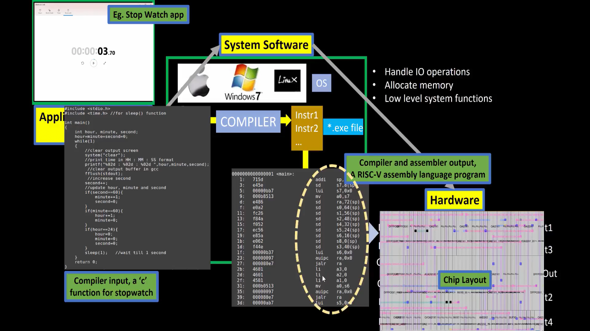
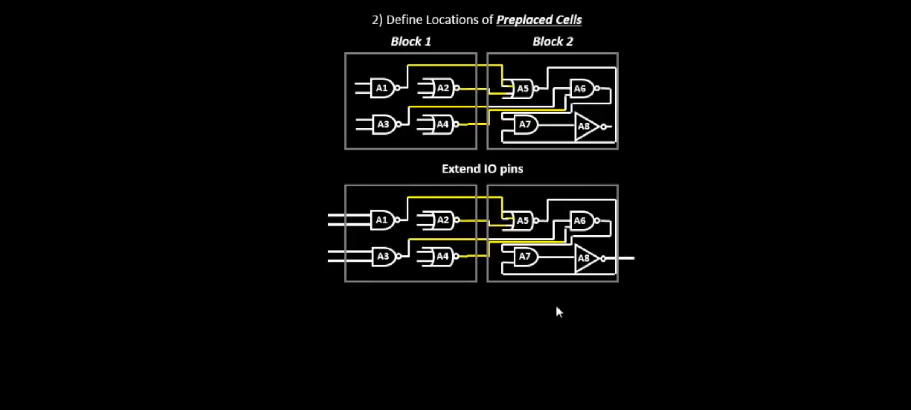
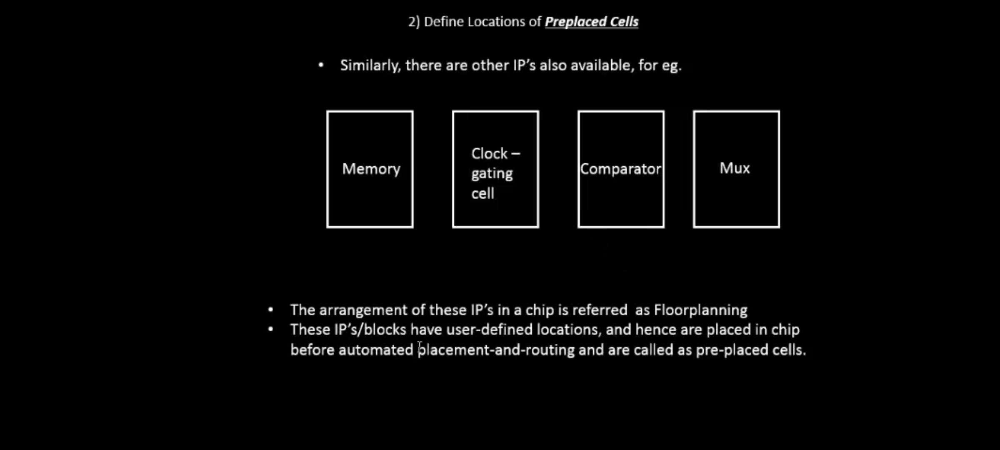

# Dgital VLSI SoC Design and Planning

### Expand to see the process for shared folders in linux and windows
<details>
  <summary><h3>Expand / Creating Shared Folder<h3></summary>

  ## Setting Up Shared Folder Between Windows and Linux VirtualBox

While working on my RISC-V SoC project in the Linux VirtualBox environment, I needed to share screenshots and files from my Linux VM to my Windows system. Here’s exactly what I did, step by step:

1. __Creating a Shared Folder in Windows__

   
    First, I created a separate folder in my Windows system to keep things organized and avoid mixing with other screenshots.
    I planned to use this folder whenever I wanted to move files between Linux and Windows.

    


2. __Configuring Shared Folder in VirtualBox Settings__
   

    - Then, I configured this folder as a shared folder in VirtualBox:
    I completely powered off the virtual machine (not saved state).
    Then I opened VirtualBox > Settings > Shared Folders for my VM and added the Folder.

    
    
    - #### Click on the small "plus file" icon on the right.

    
    
    - #### Then do the simple process shown in the image below to create the folder.
    - #### "MAKE SURE YOUR VM IS COMPLETELY SWITCHED OFF AND NOT IN SAVED STATE"

    

    - #### Just click ok and there you go.

    

    - #### As you can see there is a folder named LinuxSnaps.

#### Upto this everything should be easy : Next if the problem occurs as it did in mine.

3. __Booting into Linux & Checking the Folder__


    I added the folder but i wasn't been able to see it in my linux windows 
    SO i used this command to create the directory but it failed by saying file already exist.
    To proceed further i needed to make sure that VirtualBox Guest Additions are installed in my Linux VM. This is necessary for shared folders to work.

    Then i used this commands:
    sudo apt update
    sudo apt install virtualbox-guest-utils
    Reboot the Virtual Machine: After installation, reboot your Linux VM by typing:
    sudo reboot
    
    After starting the Linux VM again, I ran:
    
    


4. __Fixing the Permission Denied Issue__


    After that process i got the folder running in my linux but it was denying the permission when i tried to move the screenshot in that folder
    
    So I had to run "sudo usermod -aG vboxsf $USER" this is the command to become the user and access the folder. I dont have the whole process as in forgot to take the SS. But all you need is COMMAND.
    

    Then i used "sudo reboot"
    to reboot the server and make it properly work


5. __Accessing the Shared Folder and Copying Files__


    And all set now i can access my linux files in my WINDOWS as well.
    

    SO This is how i created the shared folders for my conveninvce i just shared it, so if anyone wants to do it in future they can atleast have something to refer.

</details>


<hr>

## Day 1 - Inception of open-source EDA, OpenLANE and Sky130 PDK

<details>
  <summary><h3>Theory - Click "Theory" to expand.<h3></summary>

- ##### Packiging
    In The Embedded Boards we can see the chip is implanted. As we think it's a real chip but wait that's not it - IT'S NOT A ACTUAL CHIP , BUT IT'S ONLY A PACKAGE OR WE CAN SAY A CASE TO SAVE THE ACTUAL CHIP WHICH IS INSIDE OF THAT PACKAGE. The actual chip is made of silicon and it cannot be touched by bare hands so that's why it's packed with plastic layer. The connections from package is fed to the chip by __WIRE BOUND__ method which is none other than basic wired connection.

    

    

    


- ##### Chip
    Now, Inside the chip, all the signals from the outside to the chip and from inside are passed through PADS. The area bound by the pads is CORE where all the digital logic of the chip is placed. Both the core and pads make up the DIE which is the basic manufacturing unit in regards to semiconductor chips.

    


- ##### FOUNDRY 
    It is the place where the semiconductor chips are manufactured, This Foundries should be _CLEAN_ The word clean here dosen't mean like what we do in our house, it should not have even single particle of dust or any human part like hairs. FOUNDRY IP's are Intellectual Properties based on a specific foundry and these IP's require a specific level of intelligence to be produced whereas, repeatable digital logic blocks are called MACROS.

    


- ##### ISA (Intruction Set Architecture)
    A C program which has to be run on a specific hardware layout which is the interior of a chip in your laptop, there is certain flow to be followed.
    Initially, this particular C program is compiled in it's assembly language program which is nothing but RISC-V ISA (Reduced Instruction Set Compting - V Intruction Set Architecture).
    Following this, the assembly language program is then converted to machine language program which is the binary language logic 0 and 1 which is understood by the hardware of the computer.
    Directly after this, we've to implement this RISC-V specification using some RTL (a Hardware Description Language). Finally, from the RTL to Layout it is a standard PnR or RTL to GDSII flow.

    


    For an application software to be run on a hardware there are several processes taking place. To begin with, the apps enters into a block called system software and it converts the application program to binary language. There are various layers in system software in which the major layers or components are OS (Operating System), Compiler and Assembler.
    At first the OS outputs are small function in C, C++, VB or Java language which are taken by the respective compiler and converted into instructions and the syntax of these instructions varies with the hardware architecture on which the system is implemented.
    Then, the job of the assembler is to take these instructions and convert it into it's binary format which is basically called as a machine language program. Finally, this binary language is fed to the hardware and it understands the specific functions it has to perform based on the binary code it receives.

    

    For example, if we take a stopwatch app on RISC-V core, then the output of the OS could be a small C function which enters into the compiler and we get output RISC-V instructions following this, the output of the assembler will be the binary code which enters into your chip layout.

    

    For the above stopwatch the following are the input and output of the compiler and assembler.

    

    The output of the compiler are instructions and the output of the assembler is the binary pattern. Now, we need some RTL (a Hardware Description Language) which understands and implements the particular instructions. Then, this RTL is synthesised into a netlist in form of gates which is fabricated into the chip through a physical design implementation.

    

    There are mainly 3 different parts in this course. They are:
    RISC-V ISA
    RTL and synthesis of RISC-V based CPU core - picorv32
    Physical design implementation of picorv32

    

    Open-source Implementation
    For open-source ASIC design implemantation, we require the following enablers to be readily available as open-source versions. They are:-
    RTL Designs
    EDA Tools
    PDK Data
    Initially in the early ages, the design and fabrication of IC's were tightly coupled and were only practiced by very few companies like TI, Intel, etc.
    In 1979, Lynn Conway and Carver Mead came up with an idea to saperate the design from the fabrication and to do this they inroduced structured design methodologies based on the λ-based design rules and published the first VLSI book "Introduction to VLSI System" which started the VLSI education.
    This methodology resulted in the emergence of the design only companies or "Fabless Companies" and fabrication only companies that we usually refer to as "Pure Play Fabs".
    The inteface between the designers and the fab by now became a set of data files and documents, that are reffered to as the "Process Design Kits (PDKs)".
    The PDK include but not limited to Device Models, Technology Information, Design Rules, Digital Standard Cell Libraries, I/O Libraries and many more.
    Since, the PDK contained variety of informations, and so they were distributed only under NDAs (Non-Disclosure Agreements) which made it in-accessible to the public.
    Recently, Google worked out an agreement with skywater to open-source the PDK for the 130nm process by skywater Technology, as a result on 30 June 2020 Google released the first ever open-source PDK.

    


    ASIC design is a complex step that involves tons of steps, various methodologies and respective EDA tools which are all required for successful ASIC implementation which is achieved though an ASIC flow which is nothing but a piece of software that pulls different tools togather to carry out the design process.
    


    OpenLANE Open-source ASIC Design Implementation Flow
    The main objective of the ASIC Design Flow is to take the design from the RTL (Register Transfer Level) all the way to the GDSII, which is the format used for the final fabrication layout.
    

    Synthesis is the process of convertion or translation of design RTL into circuits made out of Standard Cell Libraries (SCL) the resultant circuit is described in HDL and is usually reffered to as the Gate-Level Netlist.
    Gate-Level Netlist is functionally equivalent to the RTL.
    

    The fundemental building blocks which are the standard cells have regular layouts.
    Each cell has different views/models which are utilised by different EDA tools like liberty view with electrical models of the cells, HDL behavioral models, SPICE or CDL views of the cells, Layout view which include GDSII view which is the detailed view and LEF view which is the abstract view.
    

    Chip Floor Planning
    

    Macro Floor Planning
    

    Power Planning typically uses upper metal layers for power distribution since thay are thicker than lower metal layers and so have lower resistance and PP is done to avoid electron migration and IR drops.
    

    Placement
    

    Global placement provide approximate locations for all cells based on connectivity but in this stage the cells may be overlapped on each other and in detailed placement the positions obtained from global placements are minimally altered to make it legal (non-overlapping and in site-rows)
    

    Clock Tree Synthesis
    

    Clock skew is the time difference in arrival of clock at different components.
    Routing
    

    skywater PDK has 6 routing layers in which the lowest layer is called the local interconnect layer which is a Titanium Nitride layer the following 5 layers are all Aluminium layers.
    stackup

    Global and Detailed Routing
    

    Once done with the routing the final layout can be generated which undergoes various Sign-Off checks.
    Design Rules Checking (DRC) which verifies that the final layout honours all design fabrication rules.
    Layout Vs Schematic (LVS) which verifies that the final layout functionality matches the gate-level netlist that we started with.
    Static Timing Analysis (STA) to verify that the design runs at the designated clock frequency.
    
  

</details>

<hr>

Checking what tools and files we have access to and what we are going to work with in future. 
These are some tools we have given access to. You can see in designs and there are "pdks" and "openlane" as well, let me show you. 


<hr>

# Starting with Openlane

## Implementation

<h4> Objectives <h4>

##### 1.Run Desing Synthesis for "picorv32a" using OpenLANE & generate necessery outputs.
##### 2.Calculate the Flop ratio

- __Formula__ 


_Flop Ratio_ = _Number of Counter Flip Flops_ / _Total Number of Cells_

_Percentage of DFF's_ = _Flop Ratio_ * 100


&nbsp;&nbsp;&nbsp;&nbsp;&nbsp;&nbsp;&nbsp;&nbsp;&nbsp;&nbsp;&nbsp;&nbsp;&nbsp;_Number of D Flip Flops_  
&nbsp;&nbsp;&nbsp;_Flop Ratio_ =  &nbsp;&nbsp;&nbsp;&nbsp;&nbsp;—————————— 

&nbsp;&nbsp;&nbsp;&nbsp;&nbsp;&nbsp;&nbsp;&nbsp;&nbsp;&nbsp;_Total Number of Cells_

**Percentage of DFF's** = Flop Ratio × 100


<hr>

##### 1.Run Desing Synthesis for "picorv32a" using OpenLANE & generate necessery outputs.
#### Commands to invoke the OpenLANE flow and perform synthesis.
```bash
# As we work in Openlane we have to first change our directory to openlane flow directory. Just type -

cd Desktop/work/tools/openlane_working_dir/openlane

# alias docker ='docker run -it -v $(pwd):/openLANE_flow -v $PDK_ROOT:$PDK_ROOT -e PDK_ROOT=$PDK_ROOT -u $(id -u $USER):$(id -g $USER) efabless/openlane:v0.21'
# aliased basically means creating the short version of the command so we don't have to type very long command all the time.
# So using only 'docker' we can invoke the OpenLANE flow docker sub-system.

command - docker

# After running docker the "bash" directory will get opened where we're gonna work
```
<hr>

```bash
# As we've entered the OpenLANE flow contained docker sub-system we can invoke the OpenLANE flow in the Interactive mode using the following command
./flow.tcl -interactive

# Now use this command to open the required package
package require openlane 0.9

- Processess to be done Before Synthesis -
# Now the OpenLANE flow is ready to run any design and initially we have to prep the design creating some necessary files and directories for running a specific design which in our case is 'picorv32a'

# Design set-up stage - We need to setup a file system specific to the flow as we perform the steps we are going to fetch files from the perticular folder/location. 

# This step helps the openlane to fetch the information from single file instead fetching it from two different LEF files. So were going to merge the two files together which are - lep.lep and Tlep.

prep -design picorv32a

# Now that Preperations are done , we can run synthesis using following command
run_synthesis

# Exit from OpenLANE flow
exit

# Exit from OpenLANE flow docker sub-system
exit
```
<hr>

1. Preperation Step


You can see there is a new folder is added named _"runs"_

Now the preperation step is complete.

- If we open the file that we created it'll give us the "Date file" which stores the
data such as "results","report".


<hr>

2. Synthesis Process 


<hr>

- ### Flop count 


_Flop Count_ = 1613 / 14876 = 0.108429685

_Percentage of DFF's_ = 0.108429685 * 100 = 10.8429685 %


<hr>

### Here you can see the RESULT and the REPORT by running these commands and the files 
### inside are the whole data of it. 


.
.
.
.
.
### Day 1 comes to the end with this and we are moving on to the next Day from here.

<hr>

## Day 2 - Good floorplan vs bad floorplan and introduction to library cells

<details>
  <summary><h3>Theory</h3></summary>

#### 1. Define Height and width of core and Die.

- Basic netlist


FF - flip flop 
A1 & O1 - Standard cells like AND,OR,INVERTER

- We're taking this one netlist you can see in the image above as an example
Netlist define the connectivity between all the components 


- Each cell has Area of 1sq unit and when we connect them together,
The Total Area is - 4 squnit. 


- As you can see in the image the circular area is a silicon wafer and it has multiple cells on it and these cells are called _Die_ and the Die is made up of _Core_

__core__ : A core is a the section of the chip where the fundamental logic of the design is placed.

__Die__  : A die consist of core is a small semiconductor material speimen on which the fundamental circuit is fabricated. The DIE encapsulates the core.

- How to arrive on dimensions ? 


_Utilization Factor_ =  

&nbsp;&nbsp;&nbsp;&nbsp;&nbsp;&nbsp;&nbsp;&nbsp;_Area occupied by Netlist_  
&nbsp;&nbsp;&nbsp;&nbsp;&nbsp;&nbsp;&nbsp;&nbsp;———————————————  
&nbsp;&nbsp;&nbsp;&nbsp;&nbsp;&nbsp;&nbsp;&nbsp;_Total Area of the core_








</details>


